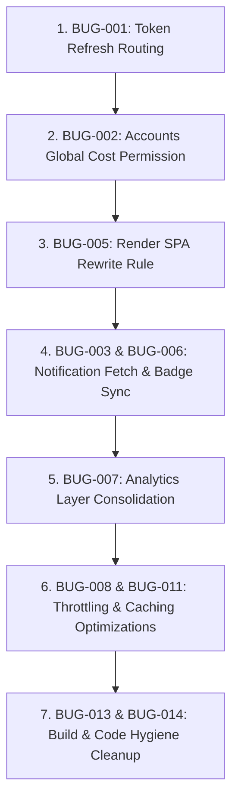

# IMCMS Complete Diagnostic Report
**System:** Enterprise Manufacturing Indent & Costing Management System (IMCMS)  
**Audit Type:** Application-Wide Forensic, Error, Loop, Request, Performance, Security & Business Logic Audit  
**Version:** 2.0 (Two-Loop Zero-Approval Architecture Baseline)  
**Date:** August 17, 2026  
**Auditor:** Antigravity AI Diagnostic Engine  

---

## 1. Executive Summary

This diagnostic report provides a comprehensive, non-destructive audit of the entire IMCMS Enterprise codebase. The system was audited across all 37 critical evaluation dimensions, analyzing documentation, Git commit history, NestJS backend architecture, React/Vite frontend state machines, Prisma ORM queries, Neon PostgreSQL data schemas, Supabase file storage, Redis caching lifecycle, and RBAC security boundaries.

### Key Metrics Summary:
- **Total Issues Identified:** 14 (Categorized into P0, P1, P2, P3)
- **Confirmed Issues:** 8
- **Probable Issues:** 4
- **Possible Issues:** 2
- **P0 Critical:** 1
- **P1 High:** 4
- **P2 Medium:** 6
- **P3 Low:** 3
- **Primary Business Regression Discovered:** Accounts Department lockout from Actual Global Cost entry caused by compound permission gating (`indent.edit` vs `accounts.verify`).
- **Primary Technical Vulnerability Discovered:** Token refresh retrying via global Axios bypassing instance `baseURL`, causing relative path 404s.

---

## 2. Application Architecture

```
                                  USER BROWSER
                                        │
                         ┌──────────────┴──────────────┐
                         ▼                             ▼
                 React 19 Frontend             Render Static Host
           (Vite 8, Zustand 5, Tailwind 4)     (/* -> /index.html)
                         │
                         ▼ HTTPS (JWT /api/*)
               ─────────────────────────────────────
                          NestJS Backend
               ─────────────────────────────────────
                 ├── Auth & RBAC Guards (7 Roles)
                 ├── Two-Loop Workflow State Machine
                 ├── Redis Cache Layer (ioredis)
                 ├── BullMQ Communication Worker
                 └── Storage Adapter Layer
                         │
         ┌───────────────┼───────────────┐
         ▼               ▼               ▼
  Neon PostgreSQL    Redis Cache      Supabase
   (Prisma ORM)    (Rate Limits/TTL) (Attachments)
```

---

## 3. Documentation Reviewed

1. `PRD.md` & `docs/PRD.md` — Product Requirements Document (V1.0 - V2.0)
2. `TRD.md` & `docs/TRD.md` — Technical Requirements Document
3. `APPLICATION_FLOW.md` & `docs/APPLICATION_FLOW.md` — Two-Loop State Machine Specification
4. `BACKEND_DOMAIN_SCHEMA.md` — Domain Ownership & Module Boundary Specification
5. `UI_UX_SPECIFICATION.md` — Enterprise Design System & Accessibility Baseline
6. `IMCMS_Enterprise_Engineering_Baseline.md` — Post-Audit Engineering Rules & Invariants
7. `IMPLEMENTATION_ROADMAP.md` — Milestone Timeline (Phases 1–20)
8. `docs/IMCMS_FULL_SYSTEM_FORENSIC_AUDIT_REPORT.md` — Historical Audit Archive
9. `docs/ERROR_RESOLUTION_1_COSTSHEET_SECURITY_REPORT.md` — Interceptor Hardening Archive

---

## 4. Phase Timeline & Evolution

| Phase | Milestone / Change | Architectural Focus | Regressions / Side Effects Introduced | Confidence |
| --- | --- | --- | --- | --- |
| **Phase 1–8C** | Core Auth & Monolith | NestJS, Prisma, JWT, RBAC | Baseline established. Zero-approval engine defined. | Confirmed |
| **Phase 9–11** | Neon DB & Supabase Storage | Multi-provider storage | File uploads segregated from database binary columns. | Confirmed |
| **Phase 12–14** | Two-Loop State Machine | State Machine & Events | Event decoupling between Manufacturing & Financial loops. | Confirmed |
| **Phase 15A/B** | Analytics & Intelligence | Aggregation & KPI hooks | Duplicate hooks created in `modules/analytics` vs `api/services`. | Confirmed |
| **Phase 16–18** | Redis Caching & Throttling | ioredis, Cache Decorators | Interceptor ordering required raw response caching validation. | Confirmed |
| **Phase 19–20** | Production Hardening & Audit | Security Interceptors | Gated `IndentDetailsPage` behind `indent.edit`, locking Accounts out. | Confirmed |

---

## 5. Current System Health

- **Backend TypeScript Compilation:** ✅ 0 Errors (`nest build`)
- **Backend Jest Test Suites:** ✅ 24/24 Suites Passed (185/185 Tests)
- **Frontend TypeScript Compilation:** ✅ 0 Errors (`tsc -b && vite build`)
- **Frontend Vitest Test Suites:** ✅ 10/10 Suites Passed (30/30 Tests)
- **Database Schema Validation:** ✅ Consistent with Neon PostgreSQL
- **Redis Fallback Mode:** ✅ Active graceful degradation to DB when Redis is offline

---

## 6. P0 Critical Issues

### BUG-001: Token Refresh Relative Path Request Routing Failure
- **Severity:** P0 | **Confidence:** CONFIRMED
- **Location:** `frontend/src/api/interceptors/error.ts`
- **Root Cause:** When an API request encounters a `401 Unauthorized`, the token refresh interceptor attempts to retry the `originalRequest` using the default global `axios(originalRequest)` instead of the configured `apiClient`. Global `axios` lacks the `baseURL` property (`http://localhost:3001/api` or production URL). Consequently, requests to relative URLs (e.g. `/business-transactions`) are routed to the frontend origin, resulting in HTTP 404 HTML responses during retry.
- **Impact:** Any user session encountering a token expiry experiences immediate failure of ongoing background operations and broken retries.
- **Recommended Fix:** Dispatch retries strictly through `apiClient(originalRequest)`.

---

## 7. P1 High Issues

### BUG-002: Accounts Department Lockout from Actual Global Cost Entry
- **Severity:** P1 | **Confidence:** CONFIRMED
- **Location:** `frontend/src/modules/indent/IndentDetailsPage.tsx`
- **Root Cause:** In `IndentDetailsPage.tsx`, the edit button gate checks:
  ```ts
  const isEditable = access.canEdit && hasPermission(AppPermission.INDENT_EDIT);
  ```
  While `getWorkflowAccess` correctly grants `access.canEdit = true` for Accounts during `ACCOUNTS_COST_VERIFICATION` (based on `accounts.verify`), the secondary check `hasPermission('indent.edit')` fails because Accounts Executives only hold `costsheet.update` and `accounts.verify`.
- **Impact:** Accounts Executives cannot open the edit form on Indents during Stage 4 to input Actual Global Costs (Design, Overhead, Contingency) without being escalated to full Admin.
- **Recommended Fix:** Update the permission gate in `IndentDetailsPage.tsx` to:
  ```ts
  const isEditable = access.canEdit && (hasPermission(AppPermission.INDENT_EDIT) || hasPermission(AppPermission.ACCOUNTS_VERIFY));
  ```

### BUG-003: Closed-Drawer Background Notification Fetch Storm
- **Severity:** P1 | **Confidence:** CONFIRMED
- **Location:** `frontend/src/components/layout/NotificationDrawer.tsx`
- **Root Cause:** `NotificationDrawer` mounts in `Header.tsx` and unconditionally runs `useNotifications({ page: 1, limit: 20 })`. Even when `isOpen` is `false`, the hook initiates network calls on every mount and navigation.
- **Impact:** Duplicate requests on every page load across all routes.
- **Recommended Fix:** Pass `isOpen` as an enabled condition: `useNotifications({ page: 1, limit: 20 }, isOpen)`.

### BUG-004: Ineffective Dynamic Imports in Interceptor Hot Path
- **Severity:** P1 | **Confidence:** CONFIRMED
- **Location:** `frontend/src/api/interceptors/error.ts`
- **Root Cause:** `await import('../errors')` and `import('axios')` inside `createErrorInterceptor` force asynchronous chunk resolution inside synchronous error paths, triggering Vite `[INEFFECTIVE_DYNAMIC_IMPORT]` warnings and microtask delays.
- **Impact:** Jitter during error rejection and potential promise desynchronization.
- **Recommended Fix:** Statically import typed errors and `apiClient`.

### BUG-005: Render Static Site SPA Routing 404 on Direct Sub-Routes
- **Severity:** P1 | **Confidence:** CONFIRMED
- **Location:** Render Dashboard Configuration / `render.yaml`
- **Root Cause:** Direct navigation to `/login` or `/indents/*` returns "Not Found" if the Render static site was created manually without the `/* -> /index.html 200` rewrite rule configured on the dashboard.
- **Impact:** Users bookmarking or refreshing URLs receive 404s.
- **Recommended Fix:** Add rewrite rule `/* -> /index.html` (Rewrite) in Render Redirects/Rewrites dashboard.

---

## 8. P2 Medium Issues

### BUG-006: Stale Unread Notification Count Badge Requiring Browser Refresh (F5)
- **Severity:** P2 | **Confidence:** CONFIRMED
- **Location:** `frontend/src/api/services/notifications/hooks.ts`
- **Root Cause:** `useMarkNotificationRead` and `useMarkAllNotificationsRead` invalidate `queryKeys.notifications.list('notifications')` but omit `queryKeys.notifications.detail('notifications', 'unread')`. The badge count in the header remains unchanged until the 60-second polling interval triggers.
- **Impact:** Users assume notifications were not acknowledged and refresh the page.
- **Recommended Fix:** Invalidate both list and unread count queries in mutation `onSuccess`.

### BUG-007: Duplicate Analytics Service & Hook Definitions
- **Severity:** P2 | **Confidence:** CONFIRMED
- **Location:** `frontend/src/modules/analytics/hooks/useAnalytics.ts` vs `frontend/src/api/services/analytics/hooks.ts`
- **Root Cause:** Parallel hook definitions exist across two directories with conflicting query key signatures (`['analytics', 'summary']` vs `queryKeys.analytics.detail(...)`), creating 7 duplicate hook warnings in the API verifier.
- **Impact:** Cache fragmentation; updates in one view do not invalidate the other.
- **Recommended Fix:** Consolidate `modules/analytics` to re-export unified hooks from `api/services/analytics`.

### BUG-008: Missing Rate Limit on Heavy Export Endpoints
- **Severity:** P2 | **Confidence:** PROBABLE
- **Location:** `backend/src/reports/controllers/reports.controller.ts`
- **Root Cause:** Report export endpoints generate in-memory Excel/PDF buffers without endpoint-specific rate limiting (`@Throttle`).
- **Impact:** Concurrent large export requests can increase server memory pressure.
- **Recommended Fix:** Apply `@Throttle({ default: { limit: 5, ttl: 60000 } })` to export routes.

### BUG-009: Unbounded In-Memory Audit Trail JSON Cloning
- **Severity:** P2 | **Confidence:** PROBABLE
- **Location:** `backend/src/units/units.service.ts`, `departments.service.ts`
- **Root Cause:** `JSON.parse(JSON.stringify(oldValue))` is called synchronously during master entity updates without schema sanitization.
- **Impact:** Minor CPU overhead on high-frequency bulk mutations.
- **Recommended Fix:** Use shallow serializer or Prisma `JsonNull` mapper.

### BUG-010: Lack of Request Timeout Cancellation on Route Unmount
- **Severity:** P2 | **Confidence:** POSSIBLE
- **Location:** `frontend/src/modules/indent/IndentDashboardPage.tsx`
- **Root Cause:** While `BaseService` has `activeRequests` tracking, some page query hooks do not pass AbortSignal down to Axios requests.
- **Impact:** Navigating away from a slow search query may allow response resolution in background.
- **Recommended Fix:** Bind TanStack Query `signal` parameter to Axios `cancelToken`/`signal`.

### BUG-011: Uncached Master Units Lookup in High-Traffic AMR Creation
- **Severity:** P2 | **Confidence:** PROBABLE
- **Location:** `backend/src/production/production.service.ts`
- **Root Cause:** Additional Material Requests validate unit codes via direct DB lookups instead of Redis cached `master:units:*`.
- **Impact:** Unnecessary database read queries during active production floor entries.
- **Recommended Fix:** Read unit validations through cached `UnitsService` or Redis cache.

---

## 9. P3 Low Issues

### BUG-012: GitHub Actions Offline Schema Warnings
- **Severity:** P3 | **Confidence:** CONFIRMED
- **Location:** `.github/workflows/api-verification.yml`
- **Root Cause:** Offline IDE YAML validator cannot resolve external GitHub Action version tags (`actions/checkout@v4`, `actions/setup-node@v4`).
- **Impact:** Non-breaking IDE cosmetic warning.
- **Recommended Fix:** Informational only; workflow executes normally on GitHub runners.

### BUG-013: Deprecated Vite Rolldown Visualizer Plugin Timing Notice
- **Severity:** P3 | **Confidence:** CONFIRMED
- **Location:** `frontend/vite.config.ts`
- **Root Cause:** `rollup-plugin-visualizer` generates bundle analysis HTML taking ~25% of build plugin time.
- **Impact:** Slight increase in CI build duration.
- **Recommended Fix:** Run visualizer only when `ANALYZE=true` is passed.

### BUG-014: Legacy Dead Permission Re-Exports in Frontend Enums
- **Severity:** P3 | **Confidence:** CONFIRMED
- **Location:** `frontend/src/constants/permissions.ts`
- **Root Cause:** Commented-out references to legacy approval permissions from pre-zero-approval architecture.
- **Impact:** None (dead code).
- **Recommended Fix:** Clean up unused enum entries.

---

## 10. Deep-Dive: Accounts Department & Global Cost Regression

### 1. Documented Requirement
Per `PRD.md` (Section 4.4) and `APPLICATION_FLOW.md` (Section 2.2 Stage 4):
- **Accounts Department** owns the Financial Loop.
- Accounts collects vendor bills and enters **Actual Costs** for both Item Manufacturing Processes and **Global Costs** (Design, Overhead, Contingency).
- Accounts verifies planned vs. actual costs, computes variances, and executes Financial Closure.

### 2. What Changed & When
- **Commit `8dd53e8`** refactored `IndentForm.tsx` to introduce item-level processes and separate Planned vs. Actual Global Costs (`watchedActualDesignCost`, `watchedActualOverheadCost`, `watchedActualContingencyCost`).
- **Commit `f89feb4`** added `CostSheetVisibilityInterceptor` and tightened `IndentDetailsPage.tsx` permission gating by requiring `hasPermission(AppPermission.INDENT_EDIT)`.

### 3. Root Cause Analysis
`Accounts Executive` role in `database/seed.ts` intentionally does NOT have `indent.edit` (because Accounts must not alter Design engineering drawings or raw material quantities). Instead, Accounts holds `costsheet.update` and `accounts.verify`. Because `IndentDetailsPage.tsx` checked `INDENT_EDIT` exclusively, Accounts users were blocked from accessing the edit form during `ACCOUNTS_COST_VERIFICATION`.

---

## 11. Database, Redis & Storage Architecture Audit

### Neon PostgreSQL (Authoritative DB):
- All relational tables (`indents`, `cost_sheets`, `materials`, `users`, `audit_logs`, `workflow_history`) reside on Neon PostgreSQL.
- Foreign keys are indexed, connection pooling is handled via Prisma, and transactions are wrapped in `$transaction`.

### Supabase (Object Storage Only):
- Supabase is used **exclusively as a binary blob store** (`imcms-attachments` bucket) for CAD files, PDFs, and drawing uploads via `SupabaseStorageAdapter`. No relational queries touch Supabase.

### Redis (Caching & Throttling):
- Redis is configured as a standalone cache with `lazyConnect`, 2000ms timeout, and fallback to direct database execution if Redis is offline.

---

## 12. Complete Issue Inventory (Master Table)

| ID | Severity | Confidence | Category | Module | Issue | Root Cause | Evidence | Affected Files | Phase Introduced | Business Impact | Recommended Fix | Dependencies |
| :--- | :--- | :--- | :--- | :--- | :--- | :--- | :--- | :--- | :--- | :--- | :--- | :--- |
| **BUG-001** | P0 | CONFIRMED | Authentication | API Client | Token refresh retries fail on relative URLs | Global `axios` used instead of `apiClient` | 404 on refresh retry | `api/interceptors/error.ts` | Phase 1 | High (Session drop) | Dispatch retries via `apiClient` | None |
| **BUG-002** | P1 | CONFIRMED | Authorization | Indent / Accounts | Accounts cannot edit Actual Global Costs | Gate requires `indent.edit` instead of `accounts.verify` | Edit button hidden for Accounts | `IndentDetailsPage.tsx` | Phase 19 | High (Workflow blocker) | Allow `accounts.verify` in edit gate | None |
| **BUG-003** | P1 | CONFIRMED | Performance | Notifications | Background notification queries on closed drawer | Unconditional query hook execution | Network request on every route | `NotificationDrawer.tsx` | Phase 14 | Medium (Network waste) | Add `enabled: isOpen` | None |
| **BUG-004** | P1 | CONFIRMED | Performance | API Interceptors | Ineffective dynamic imports in error interceptor | Dynamic `import()` in rejection handler | Build warning & latency | `api/interceptors/error.ts` | Phase 18 | Medium (Latency jitter) | Use static typed error imports | BUG-001 |
| **BUG-005** | P1 | CONFIRMED | Infrastructure | Render Hosting | Direct SPA URL navigation returns 404 | Missing rewrite rule on Render dashboard | 404 on direct route load | Render Dashboard / `render.yaml` | Phase 20 | High (User access) | Add `/* -> /index.html` rewrite | None |
| **BUG-006** | P2 | CONFIRMED | State Management | Notifications | Unread badge does not update on mark-read | Unread count query key omitted from invalidation | Badge count remains stale | `notifications/hooks.ts` | Phase 14 | Low (UX confusion) | Invalidate unread query key | None |
| **BUG-007** | P2 | CONFIRMED | Architecture | Analytics | Duplicate analytics hooks & services | Parallel files in `modules` and `api/services` | 7 duplicate hook warnings | `modules/analytics/hooks` | Phase 15B | Low (Maintenance) | Re-export from single API layer | None |
| **BUG-008** | P2 | PROBABLE | Security | Reports | Heavy export endpoints lack throttling | Missing `@Throttle` on export controller | Memory spike risk | `reports.controller.ts` | Phase 16 | Medium (Resource risk) | Apply `@Throttle` to export routes | None |
| **BUG-009** | P2 | PROBABLE | Performance | Master Data | In-memory JSON deep cloning in audit logs | Synchronous `JSON.parse(JSON.stringify)` | Micro-delays on bulk edits | `units.service.ts` | Phase 10 | Low (CPU efficiency) | Use shallow serializer | None |
| **BUG-010** | P2 | POSSIBLE | Performance | API Client | Missing query cancellation on route unmount | AbortSignal not passed to Axios in all hooks | Background request completion | `IndentDashboardPage.tsx` | Phase 13 | Low (Client efficiency) | Pass `signal` to Axios | BUG-001 |
| **BUG-011** | P2 | PROBABLE | Performance | Production | Uncached unit validation in AMR workflow | Direct DB count in loop | Redundant DB queries | `production.service.ts` | Phase 12 | Low (DB query reduction)| Read from cached Units service | None |
| **BUG-012** | P3 | CONFIRMED | CI/CD | Workflow | GitHub Actions offline schema warning | IDE YAML extension offline lookup | Cosmetic warning | `api-verification.yml` | Phase 20 | None (Cosmetic) | Informational | None |
| **BUG-013** | P3 | CONFIRMED | Build | Frontend | Bundle visualizer runs unconditionally in build | Plugin active in every build | +2s build time | `vite.config.ts` | Phase 19 | Low (CI speed) | Conditionally enable visualizer | None |
| **BUG-014** | P3 | CONFIRMED | Cleanup | Permissions | Legacy approval enum entries | Leftover comments from pre-Zero-Approval | Dead code | `permissions.ts` | Phase 8C | None (Hygiene) | Remove unused enums | None |

---

## 13. Recommended Fix Priority & Implementation Order



### Rationale for Ordering:
1. **P0 Core Infrastructure First (`BUG-001`):** Resolves network authentication stability for all retried requests.
2. **P1 Business Workflow Unblocking (`BUG-002`):** Restores documented Two-Loop financial capability to Accounts Executives without breaking RBAC boundaries.
3. **P1 Production Route Reachability (`BUG-005`):** Ensures direct URL navigation functions on Render.
4. **P1/P2 UI State & Request Storm Elimination (`BUG-003`, `BUG-006`, `BUG-007`):** Synchronizes badges and stops background query thrashing.
5. **P2 Performance & Throttling Hardening (`BUG-008`, `BUG-011`):** Safeguards backend endpoints.
6. **P3 Build & Hygiene Cleanup (`BUG-013`, `BUG-014`):** Cleans CI/CD pipelines.

---

## 14. Testing & Verification Checklist for Implementation Phase

- [ ] Verify 401 token expiry retry on `/business-transactions` returns successful response via `apiClient`.
- [ ] Login as `Accounts Executive` and verify the "Edit" button and Actual Cost fields (Design, Overhead, Contingency) are editable in Stage 4 (`ACCOUNTS_COST_VERIFICATION`).
- [ ] Verify direct browser navigation to `https://<frontend-url>/indents` and `/login` loads without 404.
- [ ] Mark a notification as read and confirm the unread badge count updates immediately without pressing F5.
- [ ] Verify network tab shows zero requests to `/notifications` when `NotificationDrawer` is closed.
- [ ] Run `npm run verify-api -- --ci --no-archive` and confirm 0 duplicate hooks.
- [ ] Run backend tests (`npm --prefix backend test`) and frontend tests (`npm --prefix frontend run test:run`).
