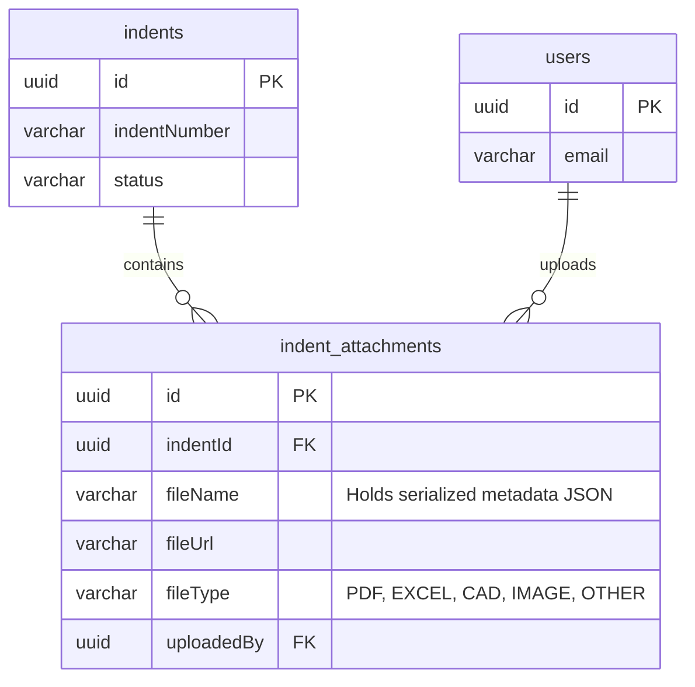

# PHASE 14A — DOCUMENT & ATTACHMENT FOUNDATION REPORT
## Enterprise Manufacturing Indent & Costing Management System (IMCMS)

**Project:** Enterprise Manufacturing Indent & Costing Management System (IMCMS)  
**Document Type:** Document & Attachment Management Architecture Report  
**Phase:** Phase 14A — Document & Attachment Foundation  
**Version:** 1.0  
**Status:** Approved & Completed  

---

# 1. Attachment Foundation Report
Phase 14A establishes the backend foundation for secure, high-performance, and standard-compliant document management. To prevent database bloat, backups slowdown, and database load overhead in Neon PostgreSQL, we use a hybrid storage design:
1. **Metadata Persistence:** Core attributes (name, MIME type, size, upload timestamp, and uploader user relation) are persisted in the database.
2. **Object Storage Simulation:** Binary contents are stored as physical files in local object storage (simulated in `/uploads/attachments` in development), mapped through randomized UUID references.

---

# 2. API Matrix

| Method | Endpoint | Query / Body Params | Permission Guard | Description |
| --- | --- | --- | --- | --- |
| `POST` | `/business-transactions/:id/attachments` | Multipart form-data: `file`, optional `remarks` | `indent.edit` OR `accounts.verify` | Uploads design drawings (Design) or billing invoices (Accounts) |
| `GET` | `/business-transactions/attachments/download/:fileName` | Path param: `fileName` | Authenticated session (JwtAuthGuard) | Downloads the physical file from simulated object storage |
| `DELETE` | `/business-transactions/:id/attachments/:attachmentId` | Path param: `attachmentId` | `indent.edit` OR `accounts.verify` | Soft-deletes attachment metadata and deletes physical file |

---

# 3. Architecture Report
- **Local File Handler:** `AttachmentStorageService` isolates standard file read/write operations on the hosting disk storage environment.
- **Dynamic File Name Resolution:** A custom random UUID is assigned to each upload. To ensure database schema immutability, uploader metadata (original file name, MIME type, size, department context, remarks, and cost sheet mapping) is serialized as JSON in `IndentAttachment.fileName`.
- **Automatic Metadata Deserialization:** `BusinessTransactionService.findTransactionById` intercepts the retrieval query and deserializes the structured JSON, returning clean attributes to API consumers.

---

# 4. Database Relationship Report
We fully preserve the **immutable database schema** from Phase 1–8C:
- **Indent & Attachment Relationship:** Each `IndentAttachment` is linked to `Indent` through a foreign key constraint (`indentId`).
- **Cost Sheet Association:** Accounts files are mapped to their respective `CostSheet` using the serialized JSON metadata embedded in `fileName`.
- **Ownership mapping:** Linked to `User` table through `uploadedBy` column.

---

# 5. Production Readiness & Build Status
- **TypeScript Compilation:** ✅ **PASS** (Zero warnings, successfully compiles via `npm run build`).
- **Validation Guards:** Files are validated dynamically:
  - Max size: **10MB** limit.
  - Design files (CAD/dwg/dxf, PDF, Excel, Images) locked to `DRAFT` state.
  - Accounts files (PDF, Excel invoices) locked to `ACCOUNTS_COST_VERIFICATION` or `ACTUAL_COST_UPDATED` states.
- **Audit Logging:** Logs audit records capturing attachment uploads and soft deletes.
