# 01 — System Architecture & Application Overview

> Enterprise Manufacturing Indent & Costing Management System (MERC / IMCMS)

---

## 1. Executive Summary

MERC (Manufacturing Enterprise Resource & Costing) is a full-stack enterprise application that manages the end-to-end lifecycle of manufacturing indents — from initial draft through material procurement, production, cost verification, financial closure, and archival.

The system implements a **Two-Loop Zero-Approval Architecture** where Loop 1 (Manufacturing) progresses through Design → Stores → Production, and Loop 2 (Financial) progresses through Accounts → Archive → Completion. Senior Manager and General Manager roles are passive notification recipients — they never approve or reject.

**Key metrics:**
- ~41 Prisma database models
- 20+ backend controllers with 100+ API endpoints
- 12-module frontend with 40+ routes
- PostgreSQL-backed email queue (replacing BullMQ/Redis)
- 7 seeded user roles with granular permission codes
- 11-state workflow state machine with optimistic concurrency control

---

## 2. Application Purpose

### Business Problem
Manufacturing organizations struggle with tracking indents (material requisition requests) through a multi-department workflow. Without a centralized system:
- Material requests get lost between Design, Stores, and Production departments
- Cost tracking is manual and error-prone
- Workflow status is unknown until someone asks
- Audit trails are incomplete
- Financial closure takes weeks

### Solution
MERC provides:
- A structured workflow pipeline with department-level ownership
- Real-time workflow status visibility
- Automated email and in-app notifications at every state transition
- Cost sheet management with predicted vs. actual cost variance
- Complete audit trail on every mutation
- Role-based access control with 71 granular permission codes

---

## 3. Major Features

| Feature | Description |
|---|---|
| Two-Loop Workflow | 11-state manufacturing + financial pipeline with state machine validation |
| Zero-Approval Architecture | SM/GM are notified but never approve — eliminates bottlenecks |
| Cost Sheet Management | Predicted vs. actual cost tracking with variance calculations |
| Material Issue Workflow | Stock verification, partial/full issue, auto-stock decrement |
| Production Tracking | Material receipt, progress updates, completion confirmation |
| Financial Closure | Actual cost entry, variance calculation, final closure |
| Email Notifications | SMTP-backed queue with retry, dead-letter, and template rendering |
| In-App Notifications | RBAC-scoped notification feed with read/unread tracking |
| Audit Trail | Every mutation logged with actor, action, timestamp, before/after |
| Document Attachments | Supabase (prod) / local (dev) file storage with MIME validation |
| Executive Analytics | KPIs, workflow analytics, department workloads, cost analytics |
| Reports | PDF and Excel report generation |
| Security | JWT auth, account lockout, session management, rate limiting |

---

## 4. Technology Stack

### Frontend

| Technology | Version | Purpose |
|---|---|---|
| React | 19.x | UI library |
| TypeScript | 6.x | Type safety |
| Vite | 8.x | Build tool / dev server |
| Tailwind CSS | 4.x | Utility-first CSS |
| React Router | 7.x | Client-side routing |
| TanStack Query | 5.x | Server-state management / data fetching |
| Zustand | 5.x | Client-side state management |
| React Hook Form | 7.x | Form state management |
| Zod | 4.x | Schema validation |
| Axios | 1.x | HTTP client |
| Lucide React | 1.x | Icon library |

### Backend

| Technology | Version | Purpose |
|---|---|---|
| Node.js | 20.x | Runtime |
| NestJS | 11.x | Application framework |
| TypeScript | 5.x | Type safety |
| Prisma | 6.x | ORM |
| PostgreSQL | 15+ | Primary database |
| Passport + JWT | — | Authentication |
| bcrypt | 6.x | Password hashing |
| Nodemailer | 9.x | SMTP email |
| Handlebars | 4.x | Email templates |
| Helmet | 8.x | Security headers |
| compression | 1.x | HTTP compression |
| exceljs | 4.x | Excel report generation |
| pdfkit | 0.19.x | PDF report generation |
| @supabase/supabase-js | 2.x | File storage |

### Infrastructure

| Technology | Purpose |
|---|---|
| Render.com | Backend + frontend deployment |
| Neon (PostgreSQL) | Managed PostgreSQL hosting |
| Supabase Storage | File attachment storage |
| Docker Compose | Local development database |
| GitHub Actions | CI/CD quality gates |
| Azure Pipelines | API contract verification |

---

## 5. Repository Structure

```
indent application/
├── backend/                    # NestJS backend application
│   ├── src/
│   │   ├── main.ts             # Application bootstrap
│   │   ├── app.module.ts       # Root module (18 sub-modules)
│   │   ├── auth/               # Authentication & authorization
│   │   ├── users/              # User management
│   │   ├── roles/              # Role management
│   │   ├── permissions/        # Permission management
│   │   ├── business-transaction/ # Core workflow engine
│   │   ├── master-data/        # Departments, Products, Materials
│   │   ├── analytics/          # KPI & executive analytics
│   │   ├── communication/      # Email & notification pipeline
│   │   ├── notifications/      # In-app notifications
│   │   ├── audit/              # Audit trail
│   │   ├── reports/            # PDF/Excel reports
│   │   ├── settings/           # Application settings
│   │   ├── observability/      # Health checks & metrics
│   │   ├── storage/            # File storage adapters
│   │   ├── processes/          # Manufacturing processes
│   │   ├── units/              # Measurement units
│   │   ├── vendors/            # Vendor management
│   │   ├── prisma/             # Prisma service
│   │   └── common/             # Shared decorators, filters, interceptors, utils
│   ├── package.json
│   └── tsconfig.json
├── frontend/                   # React frontend application
│   ├── src/
│   │   ├── app/                # Entry point, providers, router
│   │   ├── api/                # Axios client, services, hooks, interceptors
│   │   ├── store/              # Zustand stores (8 stores)
│   │   ├── hooks/              # Custom React hooks
│   │   ├── modules/            # Domain-specific page components
│   │   ├── pages/              # Route-level page components
│   │   ├── components/         # Layout, common, and UI components
│   │   ├── constants/          # Permissions, workflow, roles, validation
│   │   ├── types/              # TypeScript domain types
│   │   ├── utils/              # Utility functions
│   │   ├── styles/             # CSS tokens and global styles
│   │   └── config/             # Menu configuration
│   ├── package.json
│   └── vite.config.ts
├── database/                   # Prisma schema, migrations, seeds
│   ├── schema.prisma           # Complete database schema (1504 lines)
│   ├── seed.ts                 # Database seeder
│   ├── migrations/             # 5 migration files
│   └── *.ts                    # Utility scripts
├── tools/                      # API verification tooling
├── scripts/                    # Build/verification scripts
├── docs/                       # Documentation (126+ files)
├── render.yaml                 # Render deployment config
├── docker-compose.yml          # Local dev PostgreSQL
├── .github/workflows/          # CI/CD pipelines
└── azure-pipelines.yml         # Azure API verification
```

---

## 6. System Architecture

### High-Level Architecture

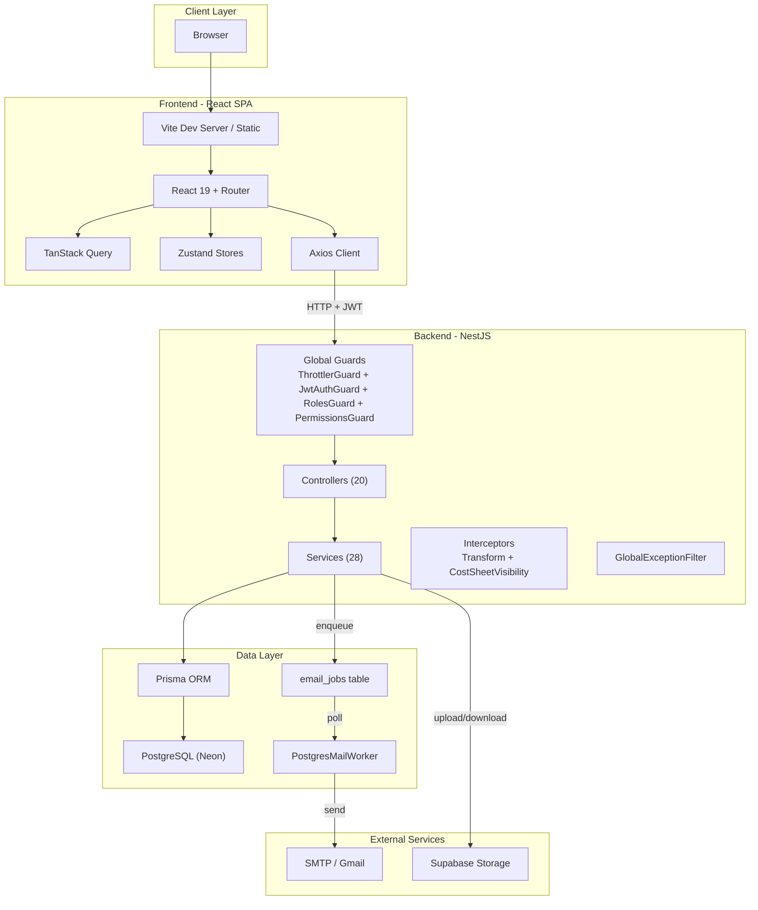

### Request Lifecycle

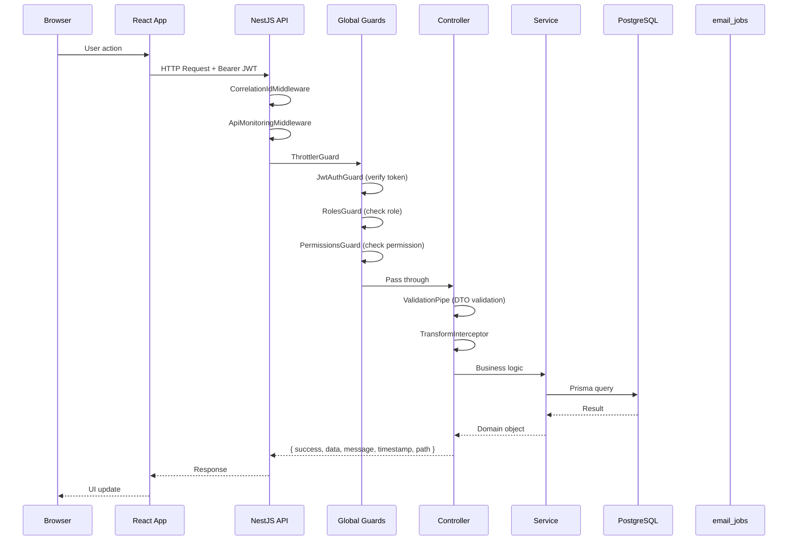

---

## 7. Frontend Architecture

### Application Bootstrap

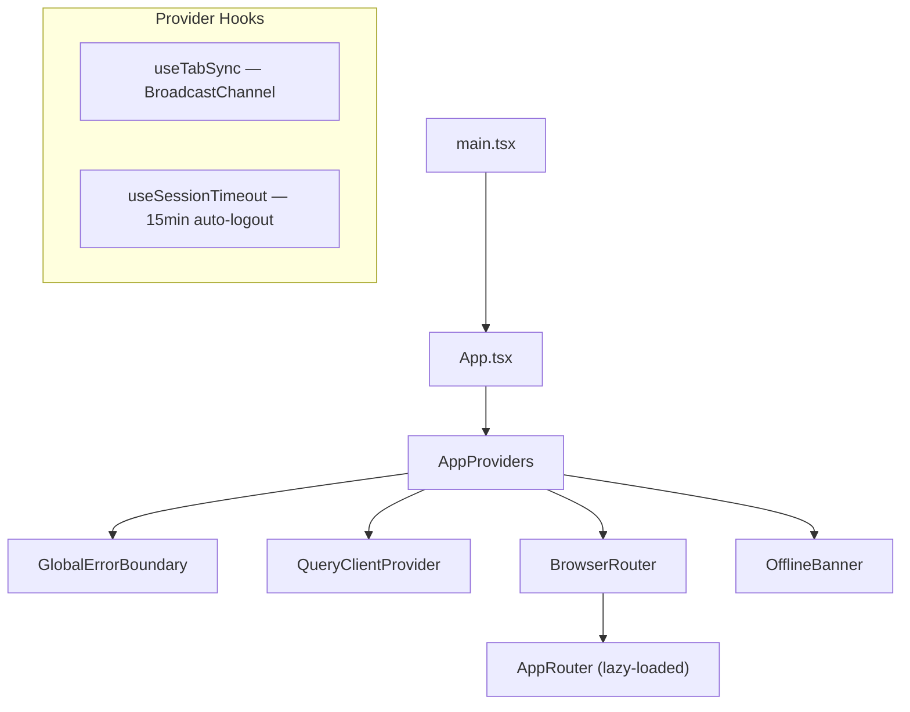

### Routing Architecture

All routes are lazy-loaded via `React.lazy()` with `<Suspense>` fallbacks.

**Public Routes:** `/login`, `/forgot-password`, `/reset-password`, `/account-locked`, `/session-expired`, `/unauthorized`, `/500`, `/maintenance`

**Protected Routes:** 40+ routes across modules — indents, cost sheets, workflow, production, analytics, reports, master data CRUD, settings, audit, communication, monitoring

### State Management

| Store | Persistence | Purpose |
|---|---|---|
| `authStore` | localStorage | User, tokens, permissions, authentication state |
| `themeStore` | localStorage | Light/dark/system theme |
| `settingsStore` | localStorage | Data density, notifications, currency format |
| `indentStore` | Session | View mode, filters, selected indent |
| `notificationStore` | Session | Notification list |
| `securityStore` | Session | Sessions, login history |
| `sidebarStore` | Session | Sidebar open/closed |
| `navigationStore` | localStorage | Favorites, recent paths |

### API Layer

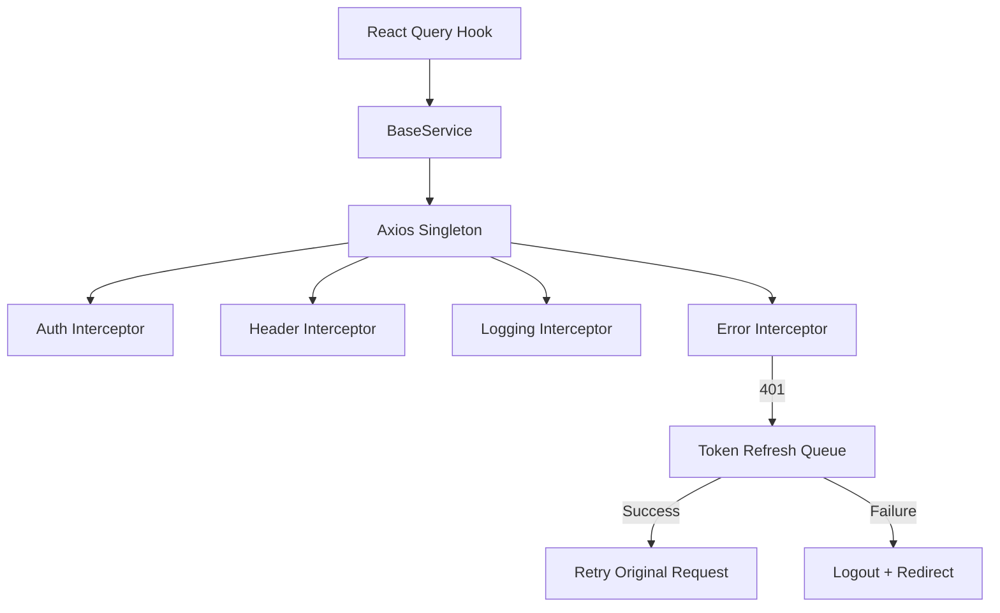

---

## 8. Backend Architecture

### Module Dependency Graph

```mermaid
graph TD
    AppModule["AppModule"] --> PrismaModule["PrismaModule (Global)"]
    AppModule --> AuthModule["AuthModule"]
    AppModule --> UsersModule["UsersModule"]
    AppModule --> RolesModule["RolesModule"]
    AppModule --> PermissionsModule["PermissionsModule"]
    AppModule --> BusinessTransactionModule["BusinessTransactionModule"]
    AppModule --> MasterDataModule["MasterDataModule"]
    AppModule --> AnalyticsModule["AnalyticsModule"]
    AppModule --> CommunicationModule["CommunicationModule (Global)"]
    AppModule --> NotificationsModule["NotificationsModule"]
    AppModule --> AuditModule["AuditModule"]
    AppModule --> ReportsModule["ReportsModule"]
    AppModule --> StorageModule["StorageModule (Global)"]
    AppModule --> SettingsModule["SettingsModule"]
    AppModule --> ObservabilityModule["ObservabilityModule (Global)"]
    AppModule --> ProcessesModule["ProcessesModule"]
    AppModule --> UnitsModule["UnitsModule"]
    AppModule --> VendorsModule["VendorsModule"]
    AppModule --> ThrottlerModule["ThrottlerModule"]
```

### Global Middleware Pipeline

| Order | Middleware/Decorator | Purpose |
|---|---|---|
| 1 | `CorrelationIdMiddleware` | Propagates `x-correlation-id` via AsyncLocalStorage |
| 2 | `ApiMonitoringMiddleware` | Tracks request duration, emits slow request events |
| 3 | `helmet` | HTTP security headers (CSP, HSTS, X-Frame-Options) |
| 4 | `compression` | Response compression (1024 byte threshold) |
| 5 | CORS | Configured origins only |
| 6 | `ThrottlerGuard` | Rate limiting (300 req/min by user ID or IP) |
| 7 | `JwtAuthGuard` | JWT Bearer token validation |
| 8 | `RolesGuard` | Role-based access control |
| 9 | `PermissionsGuard` | Permission-based access control |
| 10 | `ValidationPipe` | DTO validation (whitelist, transform) |
| 11 | `TransformInterceptor` | Wraps responses in standard envelope |

---

## 9. Database Architecture

### Technology
- **Database:** PostgreSQL 15+ (Neon serverless in production)
- **ORM:** Prisma 6.x
- **Schema Location:** `database/schema.prisma` (1504 lines)
- **UUID Primary Keys** throughout
- **Soft Delete** on all business models (`isDeleted`, `deletedAt`, `deletedBy`)
- **Audit Fields** on all models (`createdAt`, `updatedAt`, `createdBy`, `updatedBy`)

### Schema Overview (~41 models)

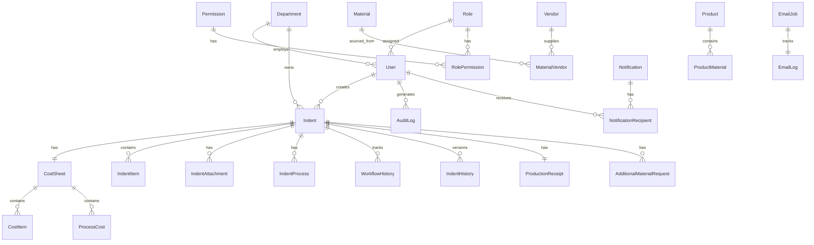

### Key Tables

| Category | Tables | Count |
|---|---|---|
| Master Data | departments, roles, permissions, role_permissions, users, vendors, units, materials, material_vendors, products, product_materials, manufacturing_processes | 12 |
| Transactions | indents, indent_items, indent_attachments, indent_processes, cost_sheets, cost_items, process_costs, additional_material_requests, additional_material_items | 9 |
| Workflow | workflow_stages, workflow_history, production_receipts, indent_history | 4 |
| Infrastructure | notifications, notification_recipients, email_logs, audit_logs, activity_logs, email_jobs | 6 |
| System | user_sessions, refresh_tokens, password_reset_tokens, application_settings, file_uploads, reports, report_downloads, machines, machine_logs, department_budgets, dashboard_widgets, dashboard_preferences, scheduled_jobs, job_execution_history, sla_trackers, timelines, document_sequences | 18 |

---

## 10. Redis Architecture

### CURRENT IMPLEMENTATION: Redis Removed

**Redis has been completely removed from the active codebase.** The email queue was migrated from BullMQ/Redis to a PostgreSQL-backed queue.

Evidence:
- `postgres-queue.service.ts` line 66: `"Redis is removed, this queue is powered by Postgres."`
- `.env` contains no Redis variables
- `.env.bak` retains `REDIS_HOST`, `REDIS_PORT`, `REDIS_PASSWORD` (backup only)
- `observability.service.ts` tracks Redis metrics (all zeroes since removal)

### TARGET ARCHITECTURE (Not Implemented)

```
DEDICATED REDIS
├── BullMQ mail.queue
├── BullMQ mail.dead.queue
└── Production distributed throttling
```

The codebase has placeholder Redis metric tracking but no actual Redis connection in production.

---

## 11. BullMQ Architecture

### CURRENT IMPLEMENTATION: PostgreSQL-Backed Queue

BullMQ/Redis has been replaced with a PostgreSQL-backed email queue.

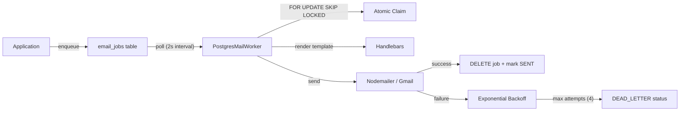

### Queue Properties

| Property | Value |
|---|---|
| Storage | PostgreSQL `email_jobs` table |
| Queue Name | `mail.queue` |
| Dead Letter | `mail.dead.queue` (status: `DEAD_LETTER`) |
| Worker Poll | Adaptive: 2s → 10s (doubles on empty, resets on claim) |
| Concurrency | Configurable via `SMTP_CONCURRENCY` (default: 2) |
| Max Attempts | Configurable via `SMTP_MAX_RETRIES` (default: 4) |
| Retry Backoff | Exponential: 5min × 2^attempts |
| Lock Duration | `SMTP_LOCK_DURATION` (default: 30s) |
| Stuck Recovery | Every 60s, reset PROCESSING jobs > 30s old |
| Atomic Claim | `FOR UPDATE SKIP LOCKED` |
| Job States | `PENDING → PROCESSING → SENT / DEAD_LETTER` |

---

## 12. External Services

| Service | Provider | Purpose | Configuration |
|---|---|---|---|
| PostgreSQL | Neon | Primary database | `DATABASE_URL` |
| SMTP | Gmail | Email delivery | `SMTP_HOST/PORT/USER/PASSWORD` |
| File Storage | Supabase | Document attachments | `SUPABASE_URL/KEY/BUCKET` |
| Deployment | Render.com | Backend + frontend hosting | `render.yaml` |

---

## 13. Authentication Architecture

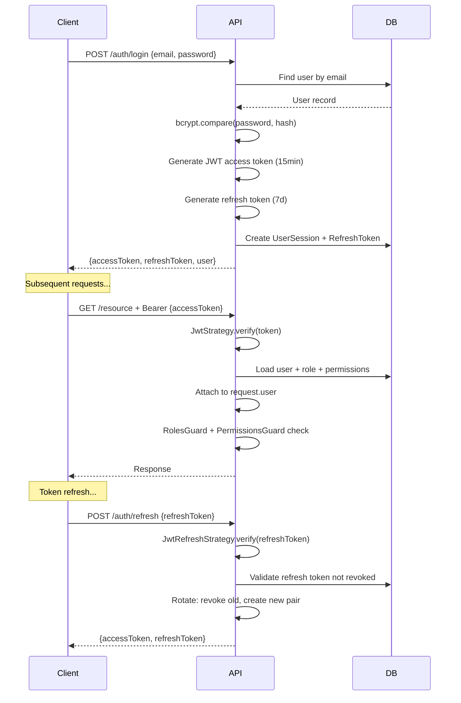

### Security Features
- **Password Policy:** Min 8 chars, must contain uppercase, lowercase, digit, special character
- **Account Lockout:** 5 failed attempts → locked for 30 minutes
- **JWT Expiry:** Access token 15 minutes, Refresh token 7 days
- **Token Rotation:** Refresh tokens are rotated on each use (old revoked)
- **Session Management:** All sessions tracked, can revoke individually or all
- **Multi-tab Sync:** BroadcastChannel synchronizes logout across tabs

---

## 14. Authorization Architecture

### Role Hierarchy (7 Seeded Roles)

| Role | Department | Key Permissions |
|---|---|---|
| Admin | ADMIN | All permissions (71 codes) — bypasses all guards |
| Design Engineer | DESIGN | `indent.create`, `indent.view`, `indent.edit`, `indent.submit`, `costsheet.view` |
| Stores Executive | STORES | `stores.issue`, `indent.view`, `materials.view`, `inventory.view` |
| Accounts Executive | ACCOUNTS | `accounts.verify`, `accounts.close`, `costsheet.view`, `indent.view` |
| Production Executive | PRODUCTION | `production.update`, `production.view`, `indent.view` |
| Senior Manager | SMGR | `indent.view`, `analytics.view`, `reports.view`, `notifications.view` |
| General Manager | GMGR | `indent.view`, `analytics.view`, `reports.view`, `notifications.view` |

### Admin Bypass Logic

Both `RolesGuard` and `PermissionsGuard` bypass all checks if:
- Role name is `ADMIN` or `SYSTEM ADMINISTRATOR`
- Role has `isSystem === true`
- Department code is `ADMIN`, `ADMINISTRATION`, or `ADM`

### Permission Codes (71 total)

Modules: `users`, `roles`, `permissions`, `departments`, `products`, `materials`, `vendors`, `manufacturing-processes`, `units`, `indent`, `costsheet`, `workflow`, `production`, `stores`, `accounts`, `inventory`, `reports`, `analytics`, `notifications`, `audit`, `settings`, `system`

---

## 15. Module Architecture

### Backend Modules (18 + infrastructure)

| Module | Purpose | Key Files |
|---|---|---|
| `AuthModule` | Login, logout, JWT, sessions, password reset | 3 controllers, 8 services, 2 strategies, 4 guards |
| `UsersModule` | User CRUD, status management | 1 controller, 1 service |
| `RolesModule` | Role CRUD, permission assignment | 1 controller, 1 service |
| `PermissionsModule` | Permission CRUD, module listing | 1 controller, 1 service |
| `BusinessTransactionModule` | Core workflow engine (11 states) | 1 controller, 4 services, state machine, validators |
| `MasterDataModule` | Departments, Products, Materials | 3 controllers |
| `AnalyticsModule` | KPIs, insights, department/cost/product/vendor analytics | 1 controller, 2 services |
| `CommunicationModule` | Email pipeline, queue, templates | 1 controller, 6+ services, worker |
| `NotificationsModule` | In-app notifications, overdue scheduler | 1 controller, 1 scheduler |
| `AuditModule` | Audit log querying | 1 controller |
| `ReportsModule` | PDF/Excel report generation | 1 controller, 1 service |
| `SettingsModule` | Application settings CRUD | 1 controller, 1 service |
| `ObservabilityModule` | Health checks, metrics, error telemetry | 1 controller, 1 service |
| `StorageModule` | Supabase/local file storage | 2 adapters |
| `ProcessesModule` | Manufacturing process CRUD | 1 controller, 1 service |
| `UnitsModule` | Measurement unit CRUD | 1 controller, 1 service |
| `VendorsModule` | Vendor CRUD | 1 controller, 1 service |
| `PrismaModule` | Database connection management | 1 service |

### Frontend Modules (16 business modules)

| Module | Pages | Components |
|---|---|---|
| `indent` | Dashboard, Form, Details | IndentForm, IndentList, IndentDetails, WorkflowTimeline, WorkflowActions, ActivityFeed |
| `costing` | Dashboard, Details | CostSheetList, CostBreakdownChart, FinancialSummaryWidget |
| `workflow` | Workflow overview | — |
| `production` | Dashboard | — |
| `analytics` | Summary, Workflow, Departments, Costs, Products, Vendors | AnalyticsLayout, Filters, Charts, Cards |
| `reports` | Dashboard, Detail | — |
| `users` | List | UserFormModal, UserDetailModal |
| `roles` | List | RoleFormModal, RoleDetailModal |
| `permissions` | List | — |
| `departments` | List | DepartmentFormModal, DepartmentDetailModal |
| `vendors` | List | VendorFormModal, VendorDetailModal |
| `units` | List | UnitFormModal, UnitDetailModal |
| `materials` | List | MaterialFormModal, MaterialDetailModal |
| `products` | List | ProductFormModal, ProductDetailModal |
| `processes` | List | ProcessFormModal, ProcessDetailModal |
| `notifications` | List | — |
| `communication` | List | — |
| `dashboard` | Master Data Dashboard | — |

---

## 16. Complete Business Workflow

### Two-Loop Architecture

```mermaid
graph LR
    subgraph "LOOP 1 — MANUFACTURING"
        D1["DRAFT"] --> D2["DESIGN_COMPLETED"]
        D2 --> D3["STORES_PROCESSING"]
        D3 --> D4["MATERIALS_ISSUED"]
        D4 --> D5["PRODUCTION_PROCESSING"]
        D5 --> D6["PRODUCTION_COMPLETED"]
    end
    
    subgraph "LOOP 2 — FINANCIAL"
        D6 --> D7["ACCOUNTS_COST_VERIFICATION"]
        D7 --> D8["ACTUAL_COST_UPDATED"]
        D8 --> D9["ACCOUNTS_FINANCIAL_CLOSURE"]
        D9 --> D10["ARCHIVED"]
        D10 --> D11["COMPLETED"]
    end
    
    style D6 fill:#f59e0b,stroke:#d97706
    style D11 fill:#10b981,stroke:#059669
```

### Department Ownership per State

| State | Department | Permission Required |
|---|---|---|
| DRAFT | DESIGN | `indent.create` |
| DESIGN_COMPLETED | DESIGN | `indent.submit` |
| STORES_PROCESSING | STORES | `stores.issue` |
| MATERIALS_ISSUED | STORES | `stores.issue` |
| PRODUCTION_PROCESSING | PRODUCTION | `production.update` |
| PRODUCTION_COMPLETED | PRODUCTION | `production.update` |
| ACCOUNTS_COST_VERIFICATION | ACCOUNTS | `accounts.verify` |
| ACTUAL_COST_UPDATED | ACCOUNTS | `accounts.verify` |
| ACCOUNTS_FINANCIAL_CLOSURE | ACCOUNTS | `accounts.close` |
| ARCHIVED | SYSTEM | `system.archive` |
| COMPLETED | SYSTEM | `system.complete` |

### Concurrency Control
Every state transition uses **optimistic locking** via `updateMany` with a `WHERE currentState = expected` clause. If another user has already transitioned the record, a `ConflictException` is thrown.

---

## 17. User Roles

| Role | Department Code | Access Pattern |
|---|---|---|
| Admin | ADMIN | Full system access, bypasses all guards |
| Design Engineer | DSN | Creates and submits indents, manages cost sheets |
| Stores Executive | STOR | Verifies stock, issues materials |
| Accounts Executive | ACCT | Enters actual costs, performs financial closure |
| Production Executive | PROD | Receives materials, starts/updates/completes production |
| Senior Manager | SMGR | Views dashboard, analytics, notifications (passive) |
| General Manager | GMGR | Views dashboard, analytics, notifications (passive) |

---

## 18. Data Flow

### Indent Lifecycle

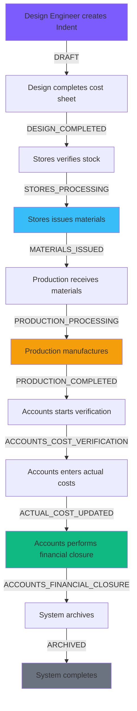

### Email Notification Flow

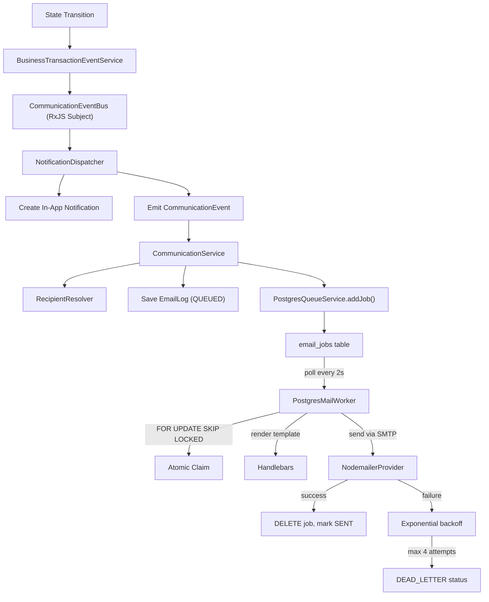

---

## 19. Notification Lifecycle

### Notification Event Types (22)

| Event | Target | Trigger |
|---|---|---|
| `USER_REGISTERED` | User | Account creation |
| `EMAIL_VERIFICATION` | User | Email verification request |
| `PASSWORD_RESET` | User | Password reset request |
| `PASSWORD_CHANGED` | User | Password changed |
| `ACCOUNT_ACTIVATED` | User | Account activated |
| `ACCOUNT_DISABLED` | User | Account disabled |
| `INDENT_SUBMITTED` | Design | Indent submitted |
| `DESIGN_COMPLETED` | Stores | Design phase completed |
| `STORES_PENDING` | Stores | Stores processing started |
| `MATERIAL_ISSUED` | Production | Materials issued |
| `PRODUCTION_STARTED` | Production | Production started |
| `PRODUCTION_COMPLETED` | Accounts | Production completed |
| `ACCOUNTS_COST_VERIFICATION` | Accounts | Cost verification started |
| `ACTUAL_COST_UPDATED` | Design + Accounts | Actual costs entered |
| `FINANCIAL_CLOSURE` | Managers | Financial closure |
| `TRANSACTION_ARCHIVED` | Managers | Transaction archived |
| `TRANSACTION_COMPLETED` | Managers | Transaction completed |
| `DOCUMENT_UPLOADED` | Relevant dept | File uploaded |
| `DOCUMENT_DELETED` | Relevant dept | File deleted |
| `DOCUMENT_REPLACED` | Relevant dept | File replaced |
| `SYSTEM_ALERT` | Admin | System alert |
| `MATERIAL_ISSUE_OVERDUE` | Stores | 48hr overdue material |

### Notification RBAC Scoping

- **Admin/System Administrator:** Sees all notifications
- **Senior/General Manager:** Sees all event types
- **Department users:** Filtered by `DEPT_EVENT_MAP` — only see events relevant to their department

---

## 20. Security Architecture

### Security Layers

| Layer | Implementation |
|---|---|
| Transport | HTTPS enforced in production (HSTS via Helmet) |
| Authentication | JWT Bearer tokens (15min access, 7d refresh) |
| Password | bcrypt hashing (salt rounds: default) |
| Authorization | RBAC with 71 permission codes + Admin bypass |
| Rate Limiting | `@nestjs/throttler` (300 req/min, per user ID or IP) |
| CORS | Whitelist: localhost + `FRONTEND_URL` only |
| Headers | Helmet (CSP, X-Frame-Options: DENY, HSTS) |
| Input Validation | class-validator + ValidationPipe (whitelist, transform) |
| SQL Injection | Prisma parameterized queries |
| File Upload | MIME signature validation, 10MB limit, department isolation |
| Account Security | 5 failed attempts → 30min lockout |
| Session Management | Revocable sessions, multi-tab sync |
| Correlation | `x-correlation-id` propagation for request tracing |
| Sensitive Data | Secrets masked in logs, `.env` not committed |

---

## 21. Deployment Architecture

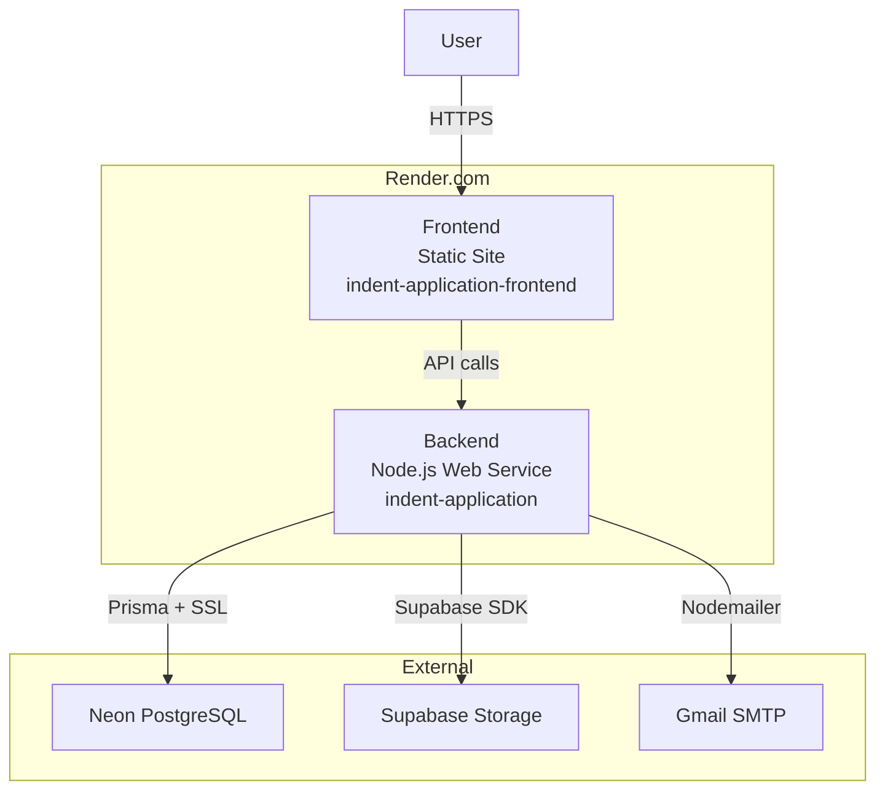

### Deployment Configuration

| Component | Platform | Region |
|---|---|---|
| Frontend | Render Static Site | Ohio |
| Backend | Render Web Service (Node 20) | Ohio |
| Database | Neon PostgreSQL | — |
| File Storage | Supabase | — |
| CI/CD | GitHub Actions + Azure Pipelines | — |

---

## 22. Environment Variables

### Backend

| Variable | Purpose | Required | Sensitive |
|---|---|---|---|
| `DATABASE_URL` | PostgreSQL connection string | Yes | Yes |
| `JWT_SECRET` | JWT signing key (min 32 chars) | Yes | Yes |
| `JWT_REFRESH_SECRET` | Refresh token signing key | Yes | Yes |
| `JWT_EXPIRES_IN` | Access token lifetime (default: 15m) | No | No |
| `JWT_REFRESH_EXPIRES_IN` | Refresh token lifetime (default: 7d) | No | No |
| `PORT` | Server port (default: 3001) | No | No |
| `SMTP_HOST` | SMTP server hostname | Yes | No |
| `SMTP_PORT` | SMTP server port | Yes | No |
| `SMTP_USER` | SMTP username | Yes | Yes |
| `SMTP_PASSWORD` | SMTP password | Yes | Yes |
| `SMTP_FROM` / `EMAIL_FROM` | Sender email address | Yes | No |
| `APP_NAME` | Application name | No | No |
| `FRONTEND_URL` | Frontend URL for CORS + emails | Yes | No |
| `SUPABASE_URL` | Supabase project URL | Yes (prod) | No |
| `SUPABASE_SERVICE_ROLE_KEY` | Supabase service key | Yes (prod) | Yes |
| `SUPABASE_STORAGE_BUCKET` | Storage bucket name | No | No |

### Frontend

| Variable | Purpose | Required |
|---|---|---|
| `VITE_API_URL` | Backend API base URL (default: `/api`) | No |
| `VITE_SOCKET_URL` | Socket URL | No |
| `VITE_APP_NAME` | Application display name | No |

---

## 23. Performance Architecture

### Code-Based Assessment

| Area | Pattern | Assessment |
|---|---|---|
| Frontend Loading | Lazy routes, code splitting | Good — all routes lazy-loaded |
| Data Fetching | TanStack Query with staleTime | Good — 5min stale time, smart retry |
| API Responses | Compression (1024 byte threshold) | Good |
| Database Queries | Prisma parameterized, indexed | Good — heavy indexing in schema |
| N+1 Prevention | Prisma `include` for eager loading | Present in some queries |
| Request Deduplication | Axios dedup, TanStack query keys | Good |
| Bundle Size | Vite + React.lazy | Not measured |
| Caching | Client-side only (TanStack staleTime) | No server-side cache |

### NOT MEASURED
- Frontend initial load time
- API response times
- Database query execution times
- Email queue processing latency

---

## 24. Scalability Assessment

| Dimension | Current | Assessment |
|---|---|---|
| Horizontal | Single Render instance | PARTIALLY READY — no multi-instance config |
| Database | Neon serverless PostgreSQL | READY — auto-scaling |
| Queue | PostgreSQL-backed (no Redis) | PARTIALLY READY — polling overhead |
| File Storage | Supabase (cloud) | READY |
| Frontend | Static CDN (Render) | READY |

---

## 25. Architecture Gaps

| Gap | Impact | Priority |
|---|---|---|
| Redis removed but metrics still tracked | Confusing observability data | LOW |
| No server-side caching | Repeated expensive queries | MEDIUM |
| PostgreSQL queue polling overhead | CPU usage under load | MEDIUM |
| No WebSocket for real-time updates | Users must poll for changes | LOW |
| Single-region deployment | No disaster recovery | MEDIUM |
| No load testing results | Unknown capacity limits | HIGH |

---

## 26. Architecture Decisions

| Decision | Rationale |
|---|---|
| PostgreSQL queue over BullMQ/Redis | Simplified infrastructure, one less dependency |
| Two-Loop workflow | Separates manufacturing from financial concerns |
| Zero-Approval for SM/GM | Eliminates approval bottlenecks |
| Optimistic locking | Avoids distributed locks while preventing concurrent corruption |
| Soft deletes everywhere | Preserves referential integrity and audit trail |
| UUID primary keys | Safe for distributed systems, no sequential leaking |
| Prisma over TypeORM | Better DX, type-safe queries, migration management |
| Zustand over Redux | Minimal boilerplate for client state |
| TanStack Query over SWR | Richer cache invalidation, mutation support |

---

## 27. Technology Rationale

| Technology | Why |
|---|---|
| NestJS | Modular architecture, dependency injection, TypeScript-first |
| Prisma | Type-safe ORM, excellent migration system, PostgreSQL support |
| React 19 | Latest features, concurrent rendering |
| Vite | Fast HMR, ESM-based builds |
| Tailwind CSS | Rapid UI development, design token integration |
| Zustand | Minimal state management without Redux boilerplate |
| TanStack Query | Server-state management, cache invalidation, background refetch |
| Neon | Serverless PostgreSQL, pay-per-use, branch support |
| Supabase | Free tier file storage, easy SDK integration |

---

## 28. Complete System Diagram

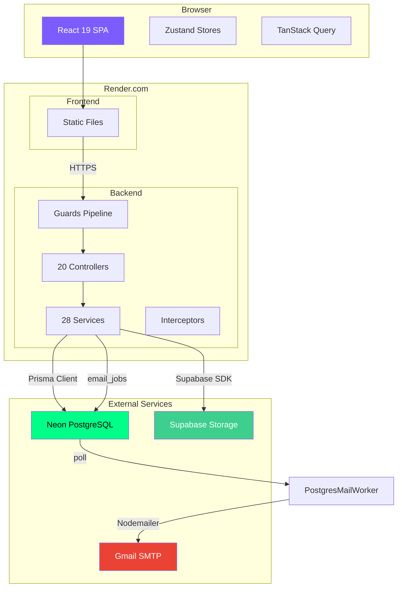

---

*This document was generated from a complete codebase audit. All architectural claims are traceable to implementation files in the repository.*
