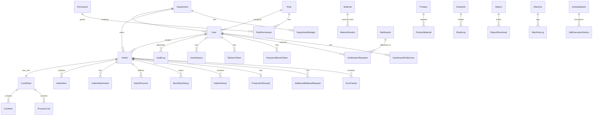

# 03 — Database & Data Architecture Guide

> Enterprise Manufacturing Indent & Costing Management System (MERC)

---

## 1. Database Overview

| Property | Value |
|---|---|
| Technology | PostgreSQL 15+ |
| Hosting | Neon (serverless) in production |
| ORM | Prisma 6.x |
| Schema Location | `database/schema.prisma` (1504 lines) |
| Primary Keys | UUID (`uuid` / `@default(uuid())`) |
| Soft Delete | All business models (`isDeleted`, `deletedAt`, `deletedBy`) |
| Audit Fields | All models (`createdAt`, `updatedAt`, `createdBy`, `updatedBy`) |
| Connection Pool | `connection_limit=20&pool_timeout=15` |

---

## 2. ORM Configuration

### Prisma Schema Location
```
database/schema.prisma
```

### Prisma Client Generation
```bash
npx prisma generate --schema=../database/schema.prisma
```

### Two Generator Targets
```prisma
generator client {
  provider = "prisma-client-js"
  output   = "../backend/node_modules/.prisma/client"
}

generator client_root {
  provider = "prisma-client-js"
  output   = "../node_modules/.prisma/client"
}
```

---

## 3. Complete Enum Reference (15 Enums)

| Enum | Values | Used In |
|---|---|---|
| `UserStatus` | `ACTIVE`, `INACTIVE`, `SUSPENDED` | users |
| `DepartmentStatus` | `ACTIVE`, `INACTIVE` | departments |
| `VendorStatus` | `ACTIVE`, `INACTIVE`, `PENDING_APPROVAL`, `BLACKLISTED` | vendors |
| `MaterialStatus` | `ACTIVE`, `INACTIVE`, `OBSOLETE` | materials |
| `ProductStatus` | `ACTIVE`, `INACTIVE`, `DISCONTINUED`, `UNDER_DEVELOPMENT` | products |
| `ProcessStatus` | `ACTIVE`, `INACTIVE` | manufacturing_processes |
| `SessionStatus` | `ACTIVE`, `EXPIRED`, `REVOKED` | user_sessions |
| `PermissionAction` | `CREATE`, `READ`, `UPDATE`, `DELETE`, `APPROVE`, `REJECT`, `ALL` | permissions |
| `NotificationType` | `INFO`, `SUCCESS`, `WARNING`, `ERROR`, `INDENT_CREATED`, `INDENT_APPROVED`, `INDENT_REJECTED` | notifications |
| `Priority` | `LOW`, `MEDIUM`, `HIGH`, `URGENT` | indents |
| `IndentStatus` | `DRAFT`, `SUBMITTED`, `PENDING_STORES`, `PENDING_ACCOUNTS`, `PENDING_SENIOR_MANAGER`, `PENDING_GENERAL_MANAGER`, `APPROVED`, `REJECTED`, `IN_PRODUCTION`, `COMPLETED`, `CANCELLED` | indents |
| `CostSheetStatus` | `DRAFT`, `FINALIZED`, `CANCELLED` | cost_sheets |
| `AMRStatus` | `DRAFT`, `PENDING`, `APPROVED`, `REJECTED` | additional_material_requests |
| `FileType` | `PDF`, `DRAWING`, `CAD`, `IMAGE`, `EXCEL`, `OTHER` | indent_attachments |
| `EmailJobStatus` | `PENDING`, `PROCESSING`, `FAILED`, `DEAD_LETTER` | email_jobs |

---

## 4. Complete Model Reference (~41 Models)

### 4.1 Master Data Models

#### `departments`

| Column | Type | Nullable | Default | Notes |
|---|---|---|---|---|
| `id` | UUID | No | `uuid()` | PK |
| `departmentCode` | VARCHAR(10) | No | — | UNIQUE |
| `departmentName` | VARCHAR(100) | No | — | |
| `description` | VARCHAR(255) | Yes | — | |
| `status` | DepartmentStatus | No | `ACTIVE` | |
| `isDeleted` | Boolean | No | `false` | |
| `createdAt` | DateTime | No | `now()` | |
| `updatedAt` | DateTime | No | `now()` | |
| `createdBy` | UUID | Yes | — | FK → users |
| `updatedBy` | UUID | Yes | — | FK → users |
| `deletedBy` | UUID | Yes | — | FK → users |
| `deletedAt` | DateTime | Yes | — | |

**Seeded data:** 7 departments (ADMIN, DSN, STOR, ACCT, PROD, SMGR, GMGR)

---

#### `roles`

| Column | Type | Nullable | Default | Notes |
|---|---|---|---|---|
| `id` | UUID | No | `uuid()` | PK |
| `roleName` | VARCHAR(100) | No | — | UNIQUE |
| `description` | VARCHAR(255) | Yes | — | |
| `isSystem` | Boolean | No | `false` | Prevents deletion |
| `isDeleted` | Boolean | No | `false` | |
| `createdAt` | DateTime | No | `now()` | |
| `updatedAt` | DateTime | No | `now()` | |
| `createdBy` | UUID | Yes | — | |
| `updatedBy` | UUID | Yes | — | |
| `deletedBy` | UUID | Yes | — | |
| `deletedAt` | DateTime | Yes | — | |

**Seeded data:** 7 roles (Admin, Design Engineer, Stores Executive, Accounts Executive, Production Executive, Senior Manager, General Manager)

---

#### `permissions`

| Column | Type | Nullable | Default | Notes |
|---|---|---|---|---|
| `id` | UUID | No | `uuid()` | PK |
| `module` | VARCHAR(100) | No | — | |
| `action` | PermissionAction | No | — | |
| `code` | VARCHAR(150) | No | — | UNIQUE (composite with module) |
| `description` | VARCHAR(255) | Yes | — | |
| `isDeleted` | Boolean | No | `false` | |
| `createdAt` | DateTime | No | `now()` | |
| `updatedAt` | DateTime | No | `now()` | |

**Seeded data:** ~50 permissions across 21 modules

---

#### `role_permissions`

| Column | Type | Nullable | Notes |
|---|---|---|---|
| `roleId` | UUID | No | PK, FK → roles |
| `permissionId` | UUID | No | PK, FK → permissions |

**Composite primary key:** (roleId, permissionId)

---

#### `users`

| Column | Type | Nullable | Default | Notes |
|---|---|---|---|---|
| `id` | UUID | No | `uuid()` | PK |
| `employeeCode` | VARCHAR(50) | No | — | UNIQUE |
| `firstName` | VARCHAR(100) | No | — | |
| `lastName` | VARCHAR(100) | No | — | |
| `email` | VARCHAR(150) | No | — | UNIQUE |
| `phone` | VARCHAR(20) | Yes | — | |
| `password` | VARCHAR(255) | No | — | bcrypt hash |
| `departmentId` | UUID | No | — | FK → departments |
| `roleId` | UUID | No | — | FK → roles |
| `status` | UserStatus | No | `ACTIVE` | |
| `profileImage` | VARCHAR(255) | Yes | — | |
| `failedLoginAttempts` | Integer | No | `0` | |
| `lockedUntil` | DateTime | Yes | — | 30min after 5 failures |
| `lastLoginAt` | DateTime | Yes | — | |
| `isDeleted` | Boolean | No | `false` | |
| `createdAt` | DateTime | No | `now()` | |
| `updatedAt` | DateTime | No | `now()` | |
| `createdBy` | UUID | Yes | — | |
| `updatedBy` | UUID | Yes | — | |
| `deletedBy` | UUID | Yes | — | |
| `deletedAt` | DateTime | Yes | — | |

**Indexes:**
- `users_email_key` (unique)
- `users_employeeCode_key` (unique)
- `users_departmentId_idx`
- `users_roleId_idx`
- `users_status_idx`
- `users_isDeleted_idx`

**Seeded data:** 7 users (all password: `Password123!`)

---

#### `vendors`

| Column | Type | Nullable | Default | Notes |
|---|---|---|---|---|
| `id` | UUID | No | `uuid()` | PK |
| `vendorCode` | VARCHAR(50) | No | — | UNIQUE |
| `vendorName` | VARCHAR(200) | No | — | |
| `email` | VARCHAR(150) | Yes | — | |
| `phone` | VARCHAR(20) | Yes | — | |
| `address` | TEXT | Yes | — | |
| `gstNumber` | VARCHAR(20) | Yes | — | UNIQUE |
| `panNumber` | VARCHAR(10) | Yes | — | UNIQUE |
| `status` | VendorStatus | No | `ACTIVE` | |
| `isDeleted` | Boolean | No | `false` | |
| `createdAt` | DateTime | No | `now()` | |
| `updatedAt` | DateTime | No | `now()` | |
| `createdBy` | UUID | Yes | — | |
| `updatedBy` | UUID | Yes | — | |
| `deletedBy` | UUID | Yes | — | |
| `deletedAt` | DateTime | Yes | — | |

---

#### `units`

| Column | Type | Nullable | Default | Notes |
|---|---|---|---|---|
| `id` | UUID | No | `uuid()` | PK |
| `unitCode` | VARCHAR(20) | No | — | UNIQUE |
| `unitName` | VARCHAR(50) | No | — | |
| `description` | VARCHAR(255) | Yes | — | |
| `isDeleted` | Boolean | No | `false` | |
| `createdAt` | DateTime | No | `now()` | |
| `updatedAt` | DateTime | No | `now()` | |

**Seeded data:** 5 units (KG, METERS, PCS, LITERS, SHEETS)

---

#### `materials`

| Column | Type | Nullable | Default | Notes |
|---|---|---|---|---|
| `id` | UUID | No | `uuid()` | PK |
| `materialCode` | VARCHAR(50) | No | — | UNIQUE |
| `materialName` | VARCHAR(200) | No | — | |
| `description` | VARCHAR(255) | Yes | — | |
| `unitId` | UUID | No | — | FK → units |
| `category` | VARCHAR(100) | Yes | — | |
| `densityKgPerDm3` | Decimal(10,4) | Yes | — | For weight calculation |
| `minStock` | Integer | Yes | `0` | |
| `maxStock` | Integer | Yes | — | |
| `currentStock` | Integer | No | `0` | Decremented on issue |
| `status` | MaterialStatus | No | `ACTIVE` | |
| `isDeleted` | Boolean | No | `false` | |
| `createdAt` | DateTime | No | `now()` | |
| `updatedAt` | DateTime | No | `now()` | |
| `createdBy` | UUID | Yes | — | |
| `updatedBy` | UUID | Yes | — | |
| `deletedBy` | UUID | Yes | — | |
| `deletedAt` | DateTime | Yes | — | |

**Indexes:**
- `materials_materialCode_key` (unique)
- `materials_unitId_idx`
- `materials_status_idx`
- `materials_isDeleted_idx`

---

#### `material_vendors`

| Column | Type | Nullable | Notes |
|---|---|---|---|
| `materialId` | UUID | No | PK, FK → materials |
| `vendorId` | UUID | No | PK, FK → vendors |

---

#### `products`

| Column | Type | Nullable | Default | Notes |
|---|---|---|---|---|
| `id` | UUID | No | `uuid()` | PK |
| `productCode` | VARCHAR(50) | No | — | UNIQUE |
| `productName` | VARCHAR(200) | No | — | |
| `description` | VARCHAR(255) | Yes | — | |
| `departmentId` | UUID | Yes | — | FK → departments |
| `drawingNumber` | VARCHAR(100) | Yes | — | |
| `revision` | VARCHAR(20) | Yes | — | |
| `status` | ProductStatus | No | `ACTIVE` | |
| `isDeleted` | Boolean | No | `false` | |
| `createdAt` | DateTime | No | `now()` | |
| `updatedAt` | DateTime | No | `now()` | |
| `createdBy` | UUID | Yes | — | |
| `updatedBy` | UUID | Yes | — | |
| `deletedBy` | UUID | Yes | — | |
| `deletedAt` | DateTime | Yes | — | |

**Seeded data:** 1 product (PRD-SHAFT)

---

#### `product_materials`

| Column | Type | Nullable | Notes |
|---|---|---|---|
| `productId` | UUID | No | PK, FK → products |
| `materialId` | UUID | No | PK, FK → materials |

---

#### `manufacturing_processes`

| Column | Type | Nullable | Default | Notes |
|---|---|---|---|---|
| `id` | UUID | No | `uuid()` | PK |
| `processName` | VARCHAR(100) | No | — | UNIQUE |
| `description` | VARCHAR(255) | Yes | — | |
| `estimatedCycleTime` | Integer | Yes | — | Minutes |
| `status` | ProcessStatus | No | `ACTIVE` | |
| `isDeleted` | Boolean | No | `false` | |
| `createdAt` | DateTime | No | `now()` | |
| `updatedAt` | DateTime | No | `now()` | |
| `createdBy` | UUID | Yes | — | |
| `updatedBy` | UUID | Yes | — | |
| `deletedBy` | UUID | Yes | — | |
| `deletedAt` | DateTime | Yes | — | |

**Seeded data:** 5 processes (Turning, Milling, Grinding, Heat Treatment, Assembly)

---

### 4.2 Transaction Models

#### `indents` (Core Business Entity)

| Column | Type | Nullable | Default | Notes |
|---|---|---|---|---|
| `id` | UUID | No | `uuid()` | PK |
| `indentNumber` | VARCHAR(50) | No | — | UNIQUE, AGIPL-IND-YYYY-NNN |
| `productId` | UUID | Yes | — | FK → products |
| `productName` | VARCHAR(200) | Yes | — | Denormalized |
| `departmentId` | UUID | No | — | FK → departments |
| `description` | TEXT | Yes | — | |
| `priority` | Priority | No | `MEDIUM` | |
| `customerName` | VARCHAR(200) | Yes | — | Customer info |
| `layoutNumber` | VARCHAR(100) | Yes | — | Layout reference |
| `status` | IndentStatus | No | `DRAFT` | Prisma enum status |
| `currentState` | VARCHAR(50) | No | `DRAFT` | Domain workflow state |
| `version` | Integer | No | `1` | Optimistic lock version |
| `isLocked` | Boolean | No | `false` | Locked after archival |
| `remarks` | TEXT | Yes | — | Workflow markers appended |
| `createdById` | UUID | No | — | FK → users |
| `isDeleted` | Boolean | No | `false` | |
| `createdAt` | DateTime | No | `now()` | |
| `updatedAt` | DateTime | No | `now()` | |
| `createdBy` | UUID | Yes | — | |
| `updatedBy` | UUID | Yes | — | |
| `deletedBy` | UUID | Yes | — | |
| `deletedAt` | DateTime | Yes | — | |

**Indexes (13):**
- `indents_indentNumber_key` (unique)
- `indents_productId_idx`
- `indents_departmentId_idx`
- `indents_createdById_idx`
- `indents_status_idx`
- `indents_currentState_idx`
- `indents_priority_idx`
- `indents_isDeleted_idx`
- `indents_createdAt_idx`
- `indents_customerName_idx`
- `indents_isLocked_idx`
- `indents_departmentId_currentState_idx` (composite)
- `indents_currentState_isDeleted_priority_idx` (composite)

---

#### `indent_items`

| Column | Type | Nullable | Default | Notes |
|---|---|---|---|---|
| `id` | UUID | No | `uuid()` | PK |
| `indentId` | UUID | No | — | FK → indents |
| `materialId` | UUID | Yes | — | FK → materials |
| `materialName` | VARCHAR(200) | Yes | — | Denormalized |
| `quantity` | Decimal(12,4) | No | — | |
| `issuedQuantity` | Decimal(12,4) | No | `0` | Updated on material issue |
| `unitId` | UUID | Yes | — | FK → units |
| `shape` | VARCHAR(50) | Yes | — | ROUND, PRISMATIC, etc. |
| `dimensions` | JSONB | Yes | — | Shape-specific dimensions |
| `unitWeightKg` | Decimal(12,4) | Yes | — | Computed from shape/density |
| `totalWeightKg` | Decimal(12,4) | Yes | — | unitWeight × quantity |
| `status` | VARCHAR(50) | No | `PENDING` | PENDING, AVAILABLE, ISSUED |
| `remarks` | TEXT | Yes | — | |
| `isDeleted` | Boolean | No | `false` | |
| `createdAt` | DateTime | No | `now()` | |
| `updatedAt` | DateTime | No | `now()` | |
| `createdBy` | UUID | Yes | — | |
| `updatedBy` | UUID | Yes | — | |
| `deletedBy` | UUID | Yes | — | |
| `deletedAt` | DateTime | Yes | — | |

---

#### `indent_attachments`

| Column | Type | Nullable | Default | Notes |
|---|---|---|---|---|
| `id` | UUID | No | `uuid()` | PK |
| `indentId` | UUID | No | — | FK → indents |
| `fileName` | VARCHAR(255) | No | — | |
| `originalFileName` | VARCHAR(255) | No | — | |
| `fileUrl` | TEXT | No | — | Supabase/local URL |
| `fileType` | FileType | No | — | PDF, DRAWING, CAD, IMAGE, EXCEL, OTHER |
| `fileSize` | Integer | Yes | — | Bytes |
| `mimeType` | VARCHAR(100) | Yes | — | |
| `uploadedById` | UUID | No | — | FK → users |
| `remarks` | TEXT | Yes | — | |
| `isDeleted` | Boolean | No | `false` | |
| `createdAt` | DateTime | No | `now()` | |
| `updatedAt` | DateTime | No | `now()` | |
| `createdBy` | UUID | Yes | — | |
| `updatedBy` | UUID | Yes | — | |
| `deletedBy` | UUID | Yes | — | |
| `deletedAt` | DateTime | Yes | — | |

---

#### `indent_processes`

| Column | Type | Nullable | Default | Notes |
|---|---|---|---|---|
| `id` | UUID | No | `uuid()` | PK |
| `indentId` | UUID | No | — | FK → indents |
| `processId` | UUID | Yes | — | FK → manufacturing_processes |
| `processName` | VARCHAR(100) | Yes | — | Denormalized |
| `sequence` | Integer | No | — | Execution order |
| `estimatedHours` | Decimal(10,2) | Yes | — | |
| `actualHours` | Decimal(10,2) | Yes | — | |
| `estimatedInputQty` | Decimal(12,4) | Yes | — | |
| `estimatedOutputQty` | Decimal(12,4) | Yes | — | |
| `estimatedScrapQty` | Decimal(12,4) | Yes | — | |
| `actualInputQty` | Decimal(12,4) | Yes | — | |
| `actualOutputQty` | Decimal(12,4) | Yes | — | |
| `actualScrapQty` | Decimal(12,4) | Yes | — | |
| `remarks` | TEXT | Yes | — | |
| `isDeleted` | Boolean | No | `false` | |
| `createdAt` | DateTime | No | `now()` | |
| `updatedAt` | DateTime | No | `now()` | |
| `createdBy` | UUID | Yes | — | |
| `updatedBy` | UUID | Yes | — | |
| `deletedBy` | UUID | Yes | — | |
| `deletedAt` | DateTime | Yes | — | |

---

#### `cost_sheets`

| Column | Type | Nullable | Default | Notes |
|---|---|---|---|---|
| `id` | UUID | No | `uuid()` | PK |
| `costNumber` | VARCHAR(50) | No | — | UNIQUE, AGIPL-CS-YYYY-NNN |
| `indentId` | UUID | No | — | FK → indents (UNIQUE) |
| `status` | CostSheetStatus | No | `DRAFT` | |
| `predictedTotal` | Decimal(18,4) | No | `0` | |
| `actualTotal` | Decimal(18,4) | No | `0` | |
| `varianceAmount` | Decimal(18,4) | No | `0` | |
| `variancePercentage` | Decimal(10,4) | No | `0` | |
| `designCost` | Decimal(18,4) | No | `0` | Predicted design cost |
| `overheadCost` | Decimal(18,4) | No | `0` | Predicted overhead |
| `contingencyCost` | Decimal(18,4) | No | `0` | Predicted contingency |
| `actualDesignCost` | Decimal(18,4) | No | `0` | |
| `actualOverheadCost` | Decimal(18,4) | No | `0` | |
| `actualContingencyCost` | Decimal(18,4) | No | `0` | |
| `isDeleted` | Boolean | No | `false` | |
| `createdAt` | DateTime | No | `now()` | |
| `updatedAt` | DateTime | No | `now()` | |
| `createdBy` | UUID | Yes | — | |
| `updatedBy` | UUID | Yes | — | |
| `deletedBy` | UUID | Yes | — | |
| `deletedAt` | DateTime | Yes | — | |

---

#### `cost_items`

| Column | Type | Nullable | Default | Notes |
|---|---|---|---|---|
| `id` | UUID | No | `uuid()` | PK |
| `costSheetId` | UUID | No | — | FK → cost_sheets |
| `itemName` | VARCHAR(200) | No | — | |
| `category` | VARCHAR(50) | No | — | MATERIAL, LABOR, etc. |
| `predictedRate` | Decimal(18,4) | No | `0` | |
| `predictedQuantity` | Decimal(12,4) | No | `0` | |
| `predictedAmount` | Decimal(18,4) | No | `0` | rate × quantity |
| `actualRate` | Decimal(18,4) | Yes | — | |
| `actualQuantity` | Decimal(12,4) | Yes | — | |
| `actualAmount` | Decimal(18,4) | Yes | — | |
| `varianceAmount` | Decimal(18,4) | No | `0` | |
| `variancePercentage` | Decimal(10,4) | No | `0` | |
| `unitId` | UUID | Yes | — | FK → units |
| `isDeleted` | Boolean | No | `false` | |
| `createdAt` | DateTime | No | `now()` | |
| `updatedAt` | DateTime | No | `now()` | |
| `createdBy` | UUID | Yes | — | |
| `updatedBy` | UUID | Yes | — | |
| `deletedBy` | UUID | Yes | — | |
| `deletedAt` | DateTime | Yes | — | |

---

#### `process_costs`

| Column | Type | Nullable | Default | Notes |
|---|---|---|---|---|
| `id` | UUID | No | `uuid()` | PK |
| `costSheetId` | UUID | No | — | FK → cost_sheets |
| `indentProcessId` | UUID | Yes | — | FK → indent_processes |
| `processName` | VARCHAR(100) | No | — | |
| `predictedCost` | Decimal(18,4) | No | `0` | |
| `actualCost` | Decimal(18,4) | Yes | — | |
| `variance` | Decimal(18,4) | No | `0` | |
| `variancePercentage` | Decimal(10,4) | No | `0` | |
| `isDeleted` | Boolean | No | `false` | |
| `createdAt` | DateTime | No | `now()` | |
| `updatedAt` | DateTime | No | `now()` | |
| `createdBy` | UUID | Yes | — | |
| `updatedBy` | UUID | Yes | — | |
| `deletedBy` | UUID | Yes | — | |
| `deletedAt` | DateTime | Yes | — | |

---

#### `additional_material_requests`

| Column | Type | Nullable | Default | Notes |
|---|---|---|---|---|
| `id` | UUID | No | `uuid()` | PK |
| `requestNumber` | VARCHAR(50) | No | — | UNIQUE |
| `parentIndentId` | UUID | No | — | FK → indents |
| `status` | AMRStatus | No | `DRAFT` | |
| `remarks` | TEXT | Yes | — | |
| `isDeleted` | Boolean | No | `false` | |
| `createdAt` | DateTime | No | `now()` | |
| `updatedAt` | DateTime | No | `now()` | |
| `createdBy` | UUID | Yes | — | |
| `updatedBy` | UUID | Yes | — | |
| `deletedBy` | UUID | Yes | — | |
| `deletedAt` | DateTime | Yes | — | |

---

#### `additional_material_items`

| Column | Type | Nullable | Default | Notes |
|---|---|---|---|---|
| `id` | UUID | No | `uuid()` | PK |
| `requestId` | UUID | No | — | FK → additional_material_requests |
| `materialId` | UUID | Yes | — | FK → materials |
| `materialName` | VARCHAR(200) | Yes | — | |
| `quantity` | Decimal(12,4) | No | — | |
| `remarks` | TEXT | Yes | — | |
| `isDeleted` | Boolean | No | `false` | |
| `createdAt` | DateTime | No | `now()` | |
| `updatedAt` | DateTime | No | `now()` | |

---

### 4.3 Workflow Models

#### `workflow_stages`

| Column | Type | Nullable | Default | Notes |
|---|---|---|---|---|
| `id` | UUID | No | `uuid()` | PK |
| `stageName` | VARCHAR(100) | No | — | UNIQUE |
| `sequence` | Integer | No | — | UNIQUE |
| `description` | VARCHAR(255) | Yes | — | |
| `departmentCode` | VARCHAR(10) | Yes | — | |
| `isDeleted` | Boolean | No | `false` | |
| `createdAt` | DateTime | No | `now()` | |
| `updatedAt` | DateTime | No | `now()` | |

---

#### `workflow_history`

| Column | Type | Nullable | Default | Notes |
|---|---|---|---|---|
| `id` | UUID | No | `uuid()` | PK |
| `indentId` | UUID | No | — | FK → indents |
| `fromState` | VARCHAR(50) | Yes | — | Previous workflow state |
| `toState` | VARCHAR(50) | No | — | New workflow state |
| `fromDepartment` | VARCHAR(10) | Yes | — | Source department |
| `toDepartment` | VARCHAR(10) | Yes | — | Target department |
| `stage` | VARCHAR(100) | Yes | — | |
| `movedById` | UUID | No | — | FK → users |
| `remarks` | TEXT | Yes | — | |
| `movedAt` | DateTime | No | `now()` | |
| `isDeleted` | Boolean | No | `false` | |
| `createdAt` | DateTime | No | `now()` | |
| `updatedAt` | DateTime | No | `now()` | |

---

#### `production_receipts`

| Column | Type | Nullable | Default | Notes |
|---|---|---|---|---|
| `id` | UUID | No | `uuid()` | PK |
| `indentId` | UUID | No | — | UNIQUE, FK → indents |
| `receivedById` | UUID | No | — | FK → users |
| `receivedAt` | DateTime | No | `now()` | |
| `remarks` | TEXT | Yes | — | |
| `isDeleted` | Boolean | No | `false` | |
| `createdAt` | DateTime | No | `now()` | |
| `updatedAt` | DateTime | No | `now()` | |

---

#### `indent_history`

| Column | Type | Nullable | Default | Notes |
|---|---|---|---|---|
| `id` | UUID | No | `uuid()` | PK |
| `indentId` | UUID | No | — | FK → indents |
| `version` | Integer | No | — | Snapshot version |
| `snapshot` | JSONB | No | — | Full indent state at version |
| `createdById` | UUID | No | — | FK → users |
| `isDeleted` | Boolean | No | `false` | |
| `createdAt` | DateTime | No | `now()` | |
| `updatedAt` | DateTime | No | `now()` | |

---

### 4.4 Infrastructure Models

#### `notifications`

| Column | Type | Nullable | Default | Notes |
|---|---|---|---|---|
| `id` | UUID | No | `uuid()` | PK |
| `eventType` | VARCHAR(50) | No | — | |
| `title` | VARCHAR(200) | No | — | |
| `message` | TEXT | No | — | |
| `relatedIndentId` | UUID | Yes | — | FK → indents |
| `createdById` | UUID | Yes | — | FK → users |
| `isDeleted` | Boolean | No | `false` | |
| `createdAt` | DateTime | No | `now()` | |
| `updatedAt` | DateTime | No | `now()` | |

---

#### `notification_recipients`

| Column | Type | Nullable | Notes |
|---|---|---|---|
| `notificationId` | UUID | No | PK, FK → notifications |
| `userId` | UUID | No | PK, FK → users |
| `isRead` | Boolean | No | `false` |
| `readAt` | DateTime | Yes | |

**Indexes:**
- `notification_recipients_userId_isRead_isDeleted_idx` (composite)

---

#### `email_logs`

| Column | Type | Nullable | Default | Notes |
|---|---|---|---|---|
| `id` | UUID | No | `uuid()` | PK |
| `to` | VARCHAR(255) | No | — | Recipient email |
| `subject` | VARCHAR(500) | No | — | |
| `template` | VARCHAR(100) | Yes | — | Template name |
| `status` | VARCHAR(20) | No | `QUEUED` | QUEUED, SENT, FAILED |
| `errorMessage` | TEXT | Yes | — | |
| `sentAt` | DateTime | Yes | — | |
| `createdAt` | DateTime | No | `now()` | |
| `updatedAt` | DateTime | No | `now()` | |

---

#### `email_jobs` (PostgreSQL-backed queue)

| Column | Type | Nullable | Default | Notes |
|---|---|---|---|---|
| `id` | UUID | No | `uuid()` | PK |
| `status` | EmailJobStatus | No | `PENDING` | PENDING, PROCESSING, FAILED, DEAD_LETTER |
| `priority` | Integer | No | `3` | 1 (High) to 5 (Low) |
| `payload` | JSONB | No | — | Email data |
| `attempts` | Integer | No | `0` | |
| `maxAttempts` | Integer | No | `4` | |
| `nextRetryAt` | DateTime | Yes | — | Exponential backoff |
| `lockedAt` | DateTime | Yes | — | When claimed by worker |
| `lockedBy` | VARCHAR(100) | Yes | — | Worker ID |
| `errorMessage` | TEXT | Yes | — | |
| `createdAt` | DateTime | No | `now()` | |
| `updatedAt` | DateTime | No | `now()` | |

**Indexes:**
- `email_jobs_status_priority_nextRetryAt_idx` (composite — used by worker polling)

---

#### `audit_logs`

| Column | Type | Nullable | Default | Notes |
|---|---|---|---|---|
| `id` | UUID | No | `uuid()` | PK |
| `userId` | UUID | Yes | — | FK → users |
| `action` | VARCHAR(50) | No | — | CREATE, UPDATE, DELETE, etc. |
| `module` | VARCHAR(50) | No | — | BUSINESS_TRANSACTION, USER, etc. |
| `recordId` | UUID | Yes | — | Affected record ID |
| `description` | TEXT | Yes | — | Human-readable description |
| `oldValues` | JSONB | Yes | — | Previous state |
| `newValues` | JSONB | Yes | — | New state |
| `ipAddress` | VARCHAR(45) | Yes | — | |
| `userAgent` | VARCHAR(500) | Yes | — | |
| `isDeleted` | Boolean | No | `false` | |
| `createdAt` | DateTime | No | `now()` | |
| `updatedAt` | DateTime | No | `now()` | |

---

#### `activity_logs`

| Column | Type | Nullable | Default | Notes |
|---|---|---|---|---|
| `id` | UUID | No | `uuid()` | PK |
| `userId` | UUID | Yes | — | FK → users |
| `action` | VARCHAR(50) | No | — | |
| `module` | VARCHAR(50) | No | — | |
| `recordId` | UUID | Yes | — | |
| `description` | TEXT | Yes | — | |
| `metadata` | JSONB | Yes | — | |
| `isDeleted` | Boolean | No | `false` | |
| `createdAt` | DateTime | No | `now()` | |
| `updatedAt` | DateTime | No | `now()` | |

---

### 4.5 System Models

#### `user_sessions`

| Column | Type | Nullable | Default | Notes |
|---|---|---|---|---|
| `id` | UUID | No | `uuid()` | PK |
| `userId` | UUID | No | — | FK → users |
| `token` | TEXT | No | — | JWT identifier |
| `ipAddress` | VARCHAR(45) | Yes | — | |
| `userAgent` | VARCHAR(500) | Yes | — | |
| `status` | SessionStatus | No | `ACTIVE` | |
| `lastAccessedAt` | DateTime | Yes | — | |
| `expiresAt` | DateTime | No | — | |
| `isDeleted` | Boolean | No | `false` | |
| `createdAt` | DateTime | No | `now()` | |
| `updatedAt` | DateTime | No | `now()` | |

---

#### `refresh_tokens`

| Column | Type | Nullable | Default | Notes |
|---|---|---|---|---|
| `id` | UUID | No | `uuid()` | PK |
| `userId` | UUID | No | — | FK → users |
| `token` | TEXT | No | — | |
| `sessionId` | UUID | Yes | — | FK → user_sessions |
| `isRevoked` | Boolean | No | `false` | |
| `expiresAt` | DateTime | No | — | 7 days |
| `createdAt` | DateTime | No | `now()` | |
| `updatedAt` | DateTime | No | `now()` | |

---

#### `password_reset_tokens`

| Column | Type | Nullable | Default | Notes |
|---|---|---|---|---|
| `id` | UUID | No | `uuid()` | PK |
| `userId` | UUID | No | — | FK → users |
| `token` | TEXT | No | — | UUID token |
| `expiresAt` | DateTime | No | — | 1 hour |
| `used` | Boolean | No | `false` | |
| `createdAt` | DateTime | No | `now()` | |
| `updatedAt` | DateTime | No | `now()` | |

---

#### `application_settings`

| Column | Type | Nullable | Default | Notes |
|---|---|---|---|---|
| `id` | UUID | No | `uuid()` | PK |
| `key` | VARCHAR(100) | No | — | UNIQUE |
| `value` | TEXT | No | — | |
| `description` | VARCHAR(255) | Yes | — | |
| `category` | VARCHAR(50) | Yes | — | |
| `isDeleted` | Boolean | No | `false` | |
| `createdAt` | DateTime | No | `now()` | |
| `updatedAt` | DateTime | No | `now()` | |

---

#### `file_uploads`

| Column | Type | Nullable | Default | Notes |
|---|---|---|---|---|
| `id` | UUID | No | `uuid()` | PK |
| `fileName` | VARCHAR(255) | No | — | |
| `originalFileName` | VARCHAR(255) | No | — | |
| `fileUrl` | TEXT | No | — | |
| `fileType` | VARCHAR(50) | Yes | — | |
| `fileSize` | Integer | Yes | — | |
| `mimeType` | VARCHAR(100) | Yes | — | |
| `uploadedById` | UUID | Yes | — | FK → users |
| `isDeleted` | Boolean | No | `false` | |
| `createdAt` | DateTime | No | `now()` | |
| `updatedAt` | DateTime | No | `now()` | |

---

#### `reports`

| Column | Type | Nullable | Default | Notes |
|---|---|---|---|---|
| `id` | UUID | No | `uuid()` | PK |
| `reportType` | VARCHAR(50) | No | — | |
| `reportName` | VARCHAR(200) | No | — | |
| `parameters` | JSONB | Yes | — | |
| `status` | VARCHAR(20) | No | `PENDING` | |
| `fileUrl` | TEXT | Yes | — | |
| `generatedById` | UUID | Yes | — | FK → users |
| `isDeleted` | Boolean | No | `false` | |
| `createdAt` | DateTime | No | `now()` | |
| `updatedAt` | DateTime | No | `now()` | |

---

#### `report_downloads`

| Column | Type | Nullable | Default | Notes |
|---|---|---|---|---|
| `id` | UUID | No | `uuid()` | PK |
| `reportId` | UUID | No | — | FK → reports |
| `downloadedById` | UUID | Yes | — | FK → users |
| `isDeleted` | Boolean | No | `false` | |
| `createdAt` | DateTime | No | `now()` | |
| `updatedAt` | DateTime | No | `now()` | |

---

#### `machines`

| Column | Type | Nullable | Default | Notes |
|---|---|---|---|---|
| `id` | UUID | No | `uuid()` | PK |
| `machineCode` | VARCHAR(50) | No | — | UNIQUE |
| `machineName` | VARCHAR(200) | No | — | |
| `description` | VARCHAR(255) | Yes | — | |
| `status` | VARCHAR(50) | No | `ACTIVE` | |
| `isDeleted` | Boolean | No | `false` | |
| `createdAt` | DateTime | No | `now()` | |
| `updatedAt` | DateTime | No | `now()` | |

---

#### `machine_logs`

| Column | Type | Nullable | Default | Notes |
|---|---|---|---|---|
| `id` | UUID | No | `uuid()` | PK |
| `machineId` | UUID | No | — | FK → machines |
| `action` | VARCHAR(50) | No | — | |
| `details` | JSONB | Yes | — | |
| `isDeleted` | Boolean | No | `false` | |
| `createdAt` | DateTime | No | `now()` | |
| `updatedAt` | DateTime | No | `now()` | |

---

#### `department_budgets`

| Column | Type | Nullable | Default | Notes |
|---|---|---|---|---|
| `id` | UUID | No | `uuid()` | PK |
| `departmentId` | UUID | No | — | FK → departments |
| `budgetAmount` | Decimal(18,4) | No | `0` | |
| `spentAmount` | Decimal(18,4) | No | `0` | |
| `fiscalYear` | Integer | No | — | |
| `isDeleted` | Boolean | No | `false` | |
| `createdAt` | DateTime | No | `now()` | |
| `updatedAt` | DateTime | No | `now()` | |

---

#### `dashboard_widgets`

| Column | Type | Nullable | Default | Notes |
|---|---|---|---|---|
| `id` | UUID | No | `uuid()` | PK |
| `widgetType` | VARCHAR(50) | No | — | |
| `configuration` | JSONB | Yes | — | |
| `isDeleted` | Boolean | No | `false` | |
| `createdAt` | DateTime | No | `now()` | |
| `updatedAt` | DateTime | No | `now()` | |

---

#### `dashboard_preferences`

| Column | Type | Nullable | Default | Notes |
|---|---|---|---|---|
| `id` | UUID | No | `uuid()` | PK |
| `userId` | UUID | No | — | FK → users |
| `layout` | JSONB | Yes | — | |
| `isDeleted` | Boolean | No | `false` | |
| `createdAt` | DateTime | No | `now()` | |
| `updatedAt` | DateTime | No | `now()` | |

---

#### `scheduled_jobs`

| Column | Type | Nullable | Default | Notes |
|---|---|---|---|---|
| `id` | UUID | No | `uuid()` | PK |
| `jobName` | VARCHAR(100) | No | — | |
| `schedule` | VARCHAR(100) | No | — | Cron expression |
| `lastRunAt` | DateTime | Yes | — | |
| `nextRunAt` | DateTime | Yes | — | |
| `status` | VARCHAR(20) | No | `ACTIVE` | |
| `isDeleted` | Boolean | No | `false` | |
| `createdAt` | DateTime | No | `now()` | |
| `updatedAt` | DateTime | No | `now()` | |

---

#### `job_execution_history`

| Column | Type | Nullable | Default | Notes |
|---|---|---|---|---|
| `id` | UUID | No | `uuid()` | PK |
| `jobId` | UUID | No | — | FK → scheduled_jobs |
| `status` | VARCHAR(20) | No | — | |
| `startedAt` | DateTime | No | `now()` | |
| `completedAt` | DateTime | Yes | — | |
| `errorMessage` | TEXT | Yes | — | |
| `isDeleted` | Boolean | No | `false` | |
| `createdAt` | DateTime | No | `now()` | |
| `updatedAt` | DateTime | No | `now()` | |

---

#### `sla_trackers`

| Column | Type | Nullable | Default | Notes |
|---|---|---|---|---|
| `id` | UUID | No | `uuid()` | PK |
| `indentId` | UUID | No | — | FK → indents |
| `stageName` | VARCHAR(100) | No | — | |
| `targetHours` | Integer | No | — | |
| `actualHours` | Integer | Yes | — | |
| `status` | VARCHAR(20) | No | `PENDING` | |
| `isDeleted` | Boolean | No | `false` | |
| `createdAt` | DateTime | No | `now()` | |
| `updatedAt` | DateTime | No | `now()` | |

---

#### `timelines`

| Column | Type | Nullable | Default | Notes |
|---|---|---|---|---|
| `id` | UUID | No | `uuid()` | PK |
| `entityType` | VARCHAR(50) | No | — | |
| `entityId` | UUID | No | — | |
| `eventType` | VARCHAR(50) | No | — | |
| `eventData` | JSONB | Yes | — | |
| `isDeleted` | Boolean | No | `false` | |
| `createdAt` | DateTime | No | `now()` | |
| `updatedAt` | DateTime | No | `now()` | |

---

#### `document_sequences`

| Column | Type | Nullable | Default | Notes |
|---|---|---|---|---|
| `id` | UUID | No | `uuid()` | PK |
| `documentType` | VARCHAR(50) | No | — | UNIQUE |
| `prefix` | VARCHAR(20) | No | — | AGIPL-IND, AGIPL-CS, etc. |
| `currentSequence` | Integer | No | `0` | |
| `year` | Integer | Yes | — | For annual reset |
| `isDeleted` | Boolean | No | `false` | |
| `createdAt` | DateTime | No | `now()` | |
| `updatedAt` | DateTime | No | `now()` | |

---

## 5. Entity Relationship Diagram



---

## 6. Migration History

| Migration | File | Purpose |
|---|---|---|
| `20260810000000_init` | 1537 lines | Full initial schema: 14 enums, all master/transaction/system tables, all indexes |
| `20260810135747_add_current_state_to_indent` | ~60 lines | Adds `currentState` VARCHAR(50) to `indents` + backfill UPDATE statements |
| `20260812000000_add_performance_indexes` | ~10 lines | Adds composite index on notification_recipients and units |
| `20260818000000_phase2_foundation_schema` | ~50 lines | Adds customerName, layoutNumber to indents; cost fields to cost_sheets; drops legacy approval_history |
| `20260824000000_init_email_jobs` | ~30 lines | Creates EmailJobStatus enum and email_jobs table |

---

## 7. Seed Data

### Departments (7)
| Code | Name |
|---|---|
| ADMIN | Administration |
| DSN | Design |
| STOR | Stores |
| ACCT | Accounts |
| PROD | Production |
| SMGR | Senior Manager |
| GMGR | General Manager |

### Roles (7)
| Name | System | Key Permissions |
|---|---|---|
| Admin | Yes | All 71 permissions |
| Design Engineer | No | indent.*, costsheet.*, products.*, materials.* |
| Stores Executive | No | stores.issue, indent.view, materials.view |
| Accounts Executive | No | accounts.*, costsheet.view, indent.view |
| Production Executive | No | production.*, indent.view |
| Senior Manager | No | indent.view, analytics.view, reports.view |
| General Manager | No | indent.view, analytics.view, reports.view |

### Users (7)
All users have password `Password123!`

| Email | Role | Department |
|---|---|---|
| admin@indent.com | Admin | ADMIN |
| design@indent.com | Design Engineer | DSN |
| stores@indent.com | Stores Executive | STOR |
| accounts@indent.com | Accounts Executive | ACCT |
| production@indent.com | Production Executive | PROD |
| senior.manager@indent.com | Senior Manager | SMGR |
| general.manager@indent.com | General Manager | GMGR |

### Products (1)
- PRD-SHAFT — Shaft

### Processes (5)
- Turning, Milling, Grinding, Heat Treatment, Assembly

### Units (5)
- KG, METERS, PCS, LITERS, SHEETS

---

## 8. Record Lifecycle

### Business Transaction Lifecycle

```
Design Engineer creates Indent
    ↓ Creates: indents, indent_items, cost_sheets, cost_items, process_costs, workflow_history
    ↓ State: DRAFT
    
Design submits → DESIGN_COMPLETED
    ↓ Updates: indents.currentState, workflow_history
    
Stores verifies stock → STORES_PROCESSING
    ↓ Updates: indent_items.status = AVAILABLE, workflow_history
    
Stores issues materials → MATERIALS_ISSUED
    ↓ Updates: materials.currentStock (decremented), indent_items.issuedQuantity, workflow_history
    
Production receives → PRODUCTION_PROCESSING
    ↓ Creates: production_receipts, workflow_history
    
Production completes → PRODUCTION_COMPLETED
    ↓ Updates: indents.currentState, workflow_history
    
Accounts starts verification → ACCOUNTS_COST_VERIFICATION
    ↓ Updates: indents.currentState, workflow_history
    
Accounts enters actual costs → ACTUAL_COST_UPDATED
    ↓ Updates: cost_items.actual*, process_costs.actual*, cost_sheets.variance*, workflow_history
    
Accounts financial closure → ACCOUNTS_FINANCIAL_CLOSURE
    ↓ Updates: cost_sheets.status = FINALIZED, workflow_history
    
System archives → ARCHIVED
    ↓ Updates: indents.isLocked = true, workflow_history
    
System completes → COMPLETED
    ↓ Terminal state
```

### Deletion Pattern

All business models use soft delete:
1. `isDeleted` set to `true`
2. `deletedAt` timestamp recorded
3. `deletedBy` user ID recorded
4. Queries filter by `isDeleted = false` by default
5. Restore available via PATCH `/:id/restore`

---

## 9. Database Performance

### Indexes
- **35+ indexes** defined in the schema
- Composite indexes for common query patterns
- Unique constraints enforce business uniqueness

### Connection Pooling
- `connection_limit=20` in DATABASE_URL
- `pool_timeout=15` seconds

### Decimal Precision
- All monetary values use `Decimal(18,4)` for exact arithmetic
- Financial calculations use `Prisma.Decimal` to avoid IEEE-754 drift

### NOT MEASURED
- Actual query execution times
- Connection pool utilization
- Query plan analysis

---

## 10. Database Risks

| Risk | Impact | Mitigation |
|---|---|---|
| Neon serverless cold start | Latency on first request after idle | Connection pooling configured |
| No read replicas | Single point for reads | Neon may handle internally |
| No backup automation visible | Data loss risk | Neon provides automated backups |
| JSONB dimensions field | Query complexity | Indexed appropriately |
| Large workflow_history tables | Growth over time | Soft delete, no purge mechanism |

---

*All table definitions extracted from `database/schema.prisma` (1504 lines) and verified against migration files.*
