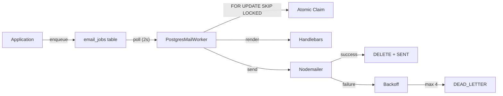

# 05 — Backend Development, Deployment & Operations Guide

> Enterprise Manufacturing Indent & Costing Management System (MERC)

---

## 1. Backend Structure

```
backend/
├── src/
│   ├── main.ts                          # Bootstrap (helmet, CORS, compression, Swagger)
│   ├── app.module.ts                    # Root module (18 sub-modules)
│   │
│   ├── auth/                            # Authentication & Authorization
│   │   ├── auth.module.ts
│   │   ├── controllers/
│   │   │   ├── auth.controller.ts       # Login, logout, refresh, password
│   │   │   ├── session.controller.ts    # Sessions, login history
│   │   │   └── security.controller.ts   # Security status, unlock
│   │   ├── services/
│   │   │   ├── auth.service.ts
│   │   │   ├── token.service.ts
│   │   │   ├── session.service.ts
│   │   │   ├── password.service.ts
│   │   │   ├── permission.service.ts
│   │   │   ├── authorization.service.ts
│   │   │   ├── login-history.service.ts
│   │   │   └── account-security.service.ts
│   │   ├── strategies/
│   │   │   ├── jwt.strategy.ts
│   │   │   └── jwt-refresh.strategy.ts
│   │   ├── guards/
│   │   │   ├── jwt-auth.guard.ts
│   │   │   ├── jwt-refresh.guard.ts
│   │   │   ├── roles.guard.ts
│   │   │   └── permissions.guard.ts
│   │   ├── decorators/
│   │   │   ├── current-user.decorator.ts
│   │   │   ├── public.decorator.ts
│   │   │   ├── roles.decorator.ts
│   │   │   └── permissions.decorator.ts
│   │   └── dto/                         # LoginDto, RefreshTokenDto, etc.
│   │
│   ├── users/
│   │   ├── users.module.ts
│   │   ├── users.controller.ts
│   │   ├── users.service.ts
│   │   └── dto/                         # CreateUserDto, UpdateUserDto, etc.
│   │
│   ├── roles/
│   │   ├── roles.module.ts
│   │   ├── roles.controller.ts
│   │   ├── roles.service.ts
│   │   └── dto/
│   │
│   ├── permissions/
│   │   ├── permissions.module.ts
│   │   ├── permissions.controller.ts
│   │   ├── permissions.service.ts
│   │   └── dto/
│   │
│   ├── business-transaction/
│   │   ├── business-transaction.module.ts
│   │   ├── business-transaction.controller.ts
│   │   ├── services/
│   │   │   ├── business-transaction.service.ts     # Core workflow engine
│   │   │   ├── workflow-state-machine.service.ts   # State transition validation
│   │   │   ├── business-transaction-event.service.ts # Notification/audit dispatch
│   │   │   └── attachment-storage.service.ts       # File upload/download
│   │   ├── enums/
│   │   │   └── workflow-state.enum.ts              # 11 workflow states
│   │   ├── definitions/
│   │   │   ├── workflow-state-machine.definition.ts # Transition rules
│   │   │   ├── notification-event.definition.ts     # Event → notification mapping
│   │   │   └── audit-event.definition.ts            # Event → audit mapping
│   │   ├── mappers/
│   │   │   └── workflow-state.mapper.ts             # Domain ↔ Prisma status
│   │   ├── validators/
│   │   │   └── workflow-state-transition.validator.ts
│   │   ├── interceptors/
│   │   │   └── cost-sheet-visibility.interceptor.ts
│   │   ├── utils/
│   │   │   └── financial-math.util.ts               # Decimal precision math
│   │   ├── dto/
│   │   └── tests/
│   │
│   ├── master-data/
│   │   ├── master-data.module.ts
│   │   ├── departments.controller.ts
│   │   ├── products.controller.ts
│   │   └── materials.controller.ts
│   │
│   ├── analytics/
│   │   ├── analytics.module.ts
│   │   ├── analytics.controller.ts
│   │   ├── analytics.service.ts
│   │   ├── kpi.service.ts
│   │   └── dto/
│   │
│   ├── communication/
│   │   ├── communication.module.ts
│   │   ├── communication.controller.ts
│   │   ├── communication.service.ts
│   │   ├── events/
│   │   │   └── communication.event.bus.ts        # RxJS Subject event bus
│   │   ├── dispatcher/
│   │   │   └── notification.dispatcher.ts        # Subscribes to bus, dispatches
│   │   ├── resolver/
│   │   │   └── recipient.resolver.ts             # Resolves email recipients
│   │   ├── queue/
│   │   │   ├── queue.constants.ts                # EmailState, IJobPayload
│   │   │   ├── postgres-queue.service.ts         # PostgreSQL-backed queue
│   │   │   └── postgres-mail.worker.ts           # Polling worker
│   │   ├── providers/
│   │   │   └── nodemailer.provider.ts            # SMTP transport
│   │   ├── config/
│   │   │   └── communication.config.ts
│   │   ├── templates/
│   │   │   ├── template.engine.ts                # Handlebars rendering
│   │   │   ├── layouts/main.hbs
│   │   │   ├── partials/header.hbs, footer.hbs
│   │   │   └── items/                            # 22+ email templates
│   │   └── tests/
│   │
│   ├── notifications/
│   │   ├── notifications.module.ts
│   │   ├── notifications.controller.ts
│   │   └── overdue-material.scheduler.ts         # Cron: 48hr overdue check
│   │
│   ├── audit/
│   │   ├── audit.module.ts
│   │   └── audit.controller.ts
│   │
│   ├── reports/
│   │   ├── reports.module.ts
│   │   ├── controllers/reports.controller.ts
│   │   ├── services/reports.service.ts
│   │   └── tests/
│   │
│   ├── settings/
│   │   ├── settings.module.ts
│   │   ├── settings.controller.ts
│   │   └── settings.service.ts
│   │
│   ├── observability/
│   │   ├── observability.module.ts
│   │   ├── observability.controller.ts
│   │   ├── observability.service.ts
│   │   ├── observability-event-bus.ts
│   │   ├── correlation-id.middleware.ts
│   │   └── api-monitoring.middleware.ts
│   │
│   ├── storage/
│   │   ├── storage.module.ts
│   │   ├── storage.interface.ts
│   │   └── adapters/
│   │       ├── supabase-storage.adapter.ts
│   │       └── local-storage.adapter.ts
│   │
│   ├── processes/
│   │   ├── processes.module.ts
│   │   ├── processes.controller.ts
│   │   └── processes.service.ts
│   │
│   ├── units/
│   │   ├── units.module.ts
│   │   ├── units.controller.ts
│   │   └── units.service.ts
│   │
│   ├── vendors/
│   │   ├── vendors.module.ts
│   │   ├── vendors.controller.ts
│   │   └── vendors.service.ts
│   │
│   ├── prisma/
│   │   ├── prisma.module.ts
│   │   └── prisma.service.ts
│   │
│   └── common/
│       ├── decorators/public.decorator.ts
│       ├── interceptors/transform.interceptor.ts
│       ├── filters/global-exception.filter.ts
│       ├── services/document-number.service.ts
│       └── utils/
│           ├── material-weight.util.ts
│           └── file-validator.util.ts
│
├── package.json
├── tsconfig.json
├── tsconfig.build.json
├── eslint.config.js
├── .prettierrc
└── .env.example
```

---

## 2. Module Architecture

### Root Module (`app.module.ts`)

**Registered Modules (18):**
1. `ScheduleModule.forRoot()` — Cron scheduling
2. `PrismaModule` — Global database access
3. `AuthModule` — Authentication & authorization
4. `RolesModule` — Role management
5. `PermissionsModule` — Permission management
6. `UsersModule` — User CRUD
7. `ProcessesModule` — Manufacturing processes
8. `UnitsModule` — Measurement units
9. `VendorsModule` — Vendor management
10. `BusinessTransactionModule` — Core workflow engine
11. `AnalyticsModule` — KPI & analytics
12. `CommunicationModule` — Email pipeline (Global)
13. `NotificationsModule` — In-app notifications
14. `AuditModule` — Audit trail
15. `MasterDataModule` — Departments, Products, Materials
16. `ReportsModule` — PDF/Excel reports
17. `StorageModule` — File storage (Global)
18. `SettingsModule` — Application settings
19. `ObservabilityModule` — Health checks (Global)
20. `ThrottlerModule` — Rate limiting (300 req/min)

### Global Guards (APP_GUARD)
1. `ThrottlerGuard` — Rate limiting
2. `JwtAuthGuard` — JWT validation (bypassed by `@Public()`)
3. `RolesGuard` — Role checking (bypassed by `@Public()`)
4. `PermissionsGuard` — Permission checking (bypassed by `@Public()`)

### Global Interceptor
- `TransformInterceptor` — Wraps responses in `{ success, message, data, timestamp, path }`

### Global Filter
- `GlobalExceptionFilter` — Catches all exceptions including Prisma errors

### Global Middleware
- `CorrelationIdMiddleware` — `x-correlation-id` propagation via AsyncLocalStorage
- `ApiMonitoringMiddleware` — Request duration tracking, slow request detection

---

## 3. Controller Conventions

- **Location:** `<module>/<module>.controller.ts` or `<module>/controllers/<module>.controller.ts`
- **Decorators:** `@Controller('<prefix>')`, `@ApiBearerAuth()`, `@UseGuards()`, `@Throttle()`
- **Parameters:** `@Body()`, `@Query()`, `@Param()`, `@CurrentUser()`
- **DTOs:** Validated via `class-validator` decorators, enforced by global `ValidationPipe`
- **Response:** All return values wrapped by `TransformInterceptor` into standard envelope

---

## 4. Service Conventions

- **Location:** `<module>/<module>.service.ts` or `<module>/services/<module>.service.ts`
- **Dependencies:** Injected via constructor (PrismaService, EventBus, etc.)
- **Business Logic:** All domain rules enforced here
- **Transactions:** Use `prisma.$transaction()` for multi-table writes
- **Audit:** Create `AuditLog` entries on mutations
- **Events:** Emit `CommunicationEvent` to event bus for notifications
- **Error Handling:** Throw `HttpException` subclasses (BadRequestException, ConflictException, NotFoundException)

---

## 5. DTO Validation

### Global ValidationPipe Configuration
```typescript
app.useGlobalPipes(new ValidationPipe({
  whitelist: true,           // Strip unknown properties
  transform: true,           // Auto-transform to DTO types
  forbidNonWhitelisted: false // Don't reject unknown properties
}));
```

### Common Validation Decorators
| Decorator | Purpose |
|---|---|
| `@IsNotEmpty()` | Required field |
| `@IsEmail()` | Email format |
| `@IsString()` | String type |
| `@IsInt()` | Integer type |
| `@IsUUID('4')` | UUID v4 format |
| `@MinLength(n)` | Minimum length |
| `@MaxLength(n)` | Maximum length |
| `@Min(n)` | Minimum value |
| `@Max(n)` | Maximum value |
| `@IsEnum(Enum)` | Enum value |
| `@IsOptional()` | Optional field |
| `@Matches(regex)` | Regex pattern |
| `@IsDateString()` | ISO date string |

---

## 6. Error Handling

### Global Exception Filter

**File:** `src/common/filters/global-exception.filter.ts`

| Exception Type | HTTP Status | Handling |
|---|---|---|
| `HttpException` | Maps status | Uses exception's status and message |
| `PrismaClientKnownRequestError` P2002 | 409 | Unique constraint violation |
| `PrismaClientKnownRequestError` P2025 | 404 | Record not found |
| `PrismaClientKnownRequestError` P2003 | 400 | FK constraint violation |
| `PrismaClientValidationError` | 400 | Schema validation error |
| `PrismaClientUnknownRequestError` | 500 | Unknown DB error |
| `PrismaClientInitializationError` | 500 | DB connection error |
| `PrismaClientRustPanicError` | 500 | Prisma engine crash |
| Generic `Error` | 500 | Internal server error |

### Response Format
```json
{
  "success": false,
  "message": "Error description",
  "errors": ["field-level details"],
  "timestamp": "2026-08-24T12:00:00.000Z",
  "path": "/api/resource"
}
```

---

## 7. Authentication

### JWT Configuration
- **Access Token:** 15 minutes (`JWT_EXPIRES_IN`)
- **Refresh Token:** 7 days (`JWT_REFRESH_EXPIRES_IN`)
- **Signing:** `JWT_SECRET` (HS256)
- **Refresh Signing:** `JWT_REFRESH_SECRET`

### Password Hashing
- Library: `bcrypt`
- Salt rounds: Default (10)
- Policy: Min 8 chars, uppercase, lowercase, digit, special character

### Account Lockout
- Threshold: 5 failed attempts
- Duration: 30 minutes
- Unlock: Manual via API or automatic after timeout

---

## 8. Authorization

### Guard Pipeline (executed in order)
1. `ThrottlerGuard` — Rate limit check
2. `JwtAuthGuard` — JWT validation (skips `@Public()`)
3. `RolesGuard` — Role check (skips `@Public()`)
4. `PermissionsGuard` — Permission check (skips `@Public()`)

### Admin Bypass
Both `RolesGuard` and `PermissionsGuard` bypass all checks if:
- Role name is `ADMIN` or `SYSTEM ADMINISTRATOR`
- Role has `isSystem === true`
- Department code is `ADMIN`, `ADMINISTRATION`, or `ADM`

### Decorator Usage
```typescript
@Post()
@Public()                                    // Skip all guards
@Throttle({ default: { limit: 5, ttl: 60000 } })
@UseGuards(JwtAuthGuard)
@Permissions('indent.create')
@Roles('Design Engineer')
create(@Body() dto: CreateIndentDto, @CurrentUser() user) { ... }
```

---

## 9. Logging

### AppLogger Service
- Custom NestJS logger with correlation ID support
- Uses `AsyncLocalStorage` for request-scoped correlation IDs
- Log levels: `log`, `error`, `warn`, `debug`, `verbose`
- Context-aware: includes module name in logs

### Correlation ID
- Header: `x-correlation-id`
- Generated by `CorrelationIdMiddleware` if not provided
- Propagated through all nested calls via `AsyncLocalStorage`
- Returned in response headers

### Request Monitoring
- `ApiMonitoringMiddleware` tracks request duration
- Emits `api.request` events to observability bus
- Detects slow requests (configurable threshold)

---

## 10. Redis (CURRENT: Removed)

### Current State
Redis has been **completely removed** from the active codebase.

### Evidence
- `postgres-queue.service.ts`: `"Redis is removed, this queue is powered by Postgres."`
- `.env` has no Redis variables
- `observability.service.ts` tracks Redis metrics (all zeroes)

### Placeholder Code Still Present
- `observability.service.ts` — Redis metric tracking (all zeroes)
- `communication.controller.ts` — Health check still reports Redis as UP
- `benchmark-redis.js` — Old benchmark script (not used)

### Target Architecture (Not Implemented)
```
DEDICATED REDIS
├── BullMQ mail.queue
├── BullMQ mail.dead.queue
└── Distributed throttling
```

---

## 11. PostgreSQL-Backed Email Queue

### Architecture



### Queue Configuration

| Property | Value | Env Variable |
|---|---|---|
| Poll interval | 2s (adaptive up to 10s) | — |
| Concurrency | 2 | `SMTP_CONCURRENCY` |
| Max attempts | 4 | `SMTP_MAX_RETRIES` |
| Retry backoff | 5min × 2^attempt | — |
| Lock duration | 30s | `SMTP_LOCK_DURATION` |
| Stuck recovery | Every 60s | — |

### Job States
```
PENDING → PROCESSING → SENT (success)
              ↓
          RETRYING → PENDING (backoff)
              ↓
         DEAD_LETTER (max attempts)
```

### Worker Algorithm
1. Adaptive poll: starts at 2s, doubles on empty, resets on claim
2. Atomic claim: `UPDATE email_jobs SET status='PROCESSING', lockedAt=now(), lockedBy=$workerId WHERE status='PENDING' AND (nextRetryAt IS NULL OR nextRetryAt <= now()) FOR UPDATE SKIP LOCKED LIMIT $concurrency`
3. Process: render Handlebars template → send via Nodemailer
4. On success: DELETE job, mark `email_logs.status = 'SENT'`
5. On failure: increment attempts, set `nextRetryAt = now() + (5min × 2^attempts)`
6. On max attempts: set status = `DEAD_LETTER`
7. Stuck recovery: every 60s, reset `PROCESSING` jobs older than lock duration to `PENDING`

### Graceful Shutdown
- Waits up to 10s for active jobs to finish
- Sets `isShuttingDown = true` to stop polling

---

## 12. Observability

### Health Checks

#### Liveness (`GET /api/observability/health/liveness`)
- Always returns `UP`
- No authentication required

#### Readiness (`GET /api/observability/health/readiness`)
- Checks database connectivity
- Checks queue (email_jobs table) connectivity
- Returns `503` if any service is DOWN
- No authentication required

### Metrics (`GET /api/observability/metrics`)
Requires `settings.manage` permission.

Metrics tracked:
- API: Request count, duration, slow requests
- DB: Query count, duration, connections
- Redis: All zeroes (Redis removed)
- Workflow: Transition count, success/failure
- Auth: Login success/failure, token refresh
- Notification: Sent, failed, queued
- Node: Memory, CPU, uptime
- Frontend: Error count, type breakdown

### Frontend Error Telemetry
- `POST /api/observability/frontend-errors`
- Public endpoint (no auth)
- Sanitizes/trims input
- Logs to observability service

---

## 13. Interceptors

### TransformInterceptor
**File:** `src/common/interceptors/transform.interceptor.ts`

Wraps all responses:
```json
{
  "success": true,
  "message": "Operation successful",
  "data": <original response>,
  "timestamp": "2026-08-24T12:00:00.000Z",
  "path": "/api/resource"
}
```

### CostSheetVisibilityInterceptor
**File:** `src/business-transaction/interceptors/cost-sheet-visibility.interceptor.ts`

Hides cost sheet data from users without `costsheet.view` permission. Applied to `BusinessTransactionController`.

---

## 14. Middleware

### CorrelationIdMiddleware
**File:** `src/observability/correlation-id.middleware.ts`

- Extracts `x-correlation-id` from request headers
- Generates UUID if not present
- Stores in `AsyncLocalStorage` for nested call propagation
- Adds to response headers

### ApiMonitoringMiddleware
**File:** `src/observability/api-monitoring.middleware.ts`

- Records request start time
- Calculates duration on response
- Emits `api.request` event to observability bus
- Logs slow requests (configurable threshold)

---

## 15. Storage System

### Interface
```typescript
interface IStorageAdapter {
  upload(fileName: string, file: Buffer): Promise<void>;
  getDownloadStream(fileName: string): Promise<StorageStreamInfo>;
  delete(fileName: string): Promise<void>;
  exists(fileName: string): Promise<boolean>;
}
```

### Adapters

| Adapter | When Used |
|---|---|
| `SupabaseStorageAdapter` | Production OR when `SUPABASE_URL` + `SUPABASE_SERVICE_ROLE_KEY` are set |
| `LocalStorageAdapter` | Local development without Supabase |

---

## 16. Deployment

### Prerequisites
- Node.js 20+
- PostgreSQL 15+ (Neon in production)
- SMTP server (Gmail in production)
- Supabase account (for file storage)

### Environment Variables

See Document 1, Section 20 for complete list.

### Database Setup
```bash
# Generate Prisma client
npx prisma generate --schema=../database/schema.prisma

# Run migrations
npx prisma migrate deploy --schema=../database/schema.prisma

# Seed initial data
npx ts-node ../database/seed.ts
```

### Build
```bash
cd backend
npm install
npx prisma generate --schema=../database/schema.prisma
npx nest build
```

### Start
```bash
# Development
npm run start:dev

# Production
npm run start:prod
# Runs: node dist/main
```

### Worker Startup
The email queue worker starts automatically as part of the NestJS application lifecycle (via `OnModuleInit` on `PostgresMailWorker`).

---

## 17. Production Configuration

### Render.com Deployment

**Service:** `indent-application` (Node.js Web Service)

| Setting | Value |
|---|---|
| Region | Ohio |
| Runtime | Node 20 |
| Root Directory | `backend` |
| Build Command | `npm install && npx prisma generate --schema=../database/schema.prisma && npx prisma migrate deploy --schema=../database/schema.prisma && npx nest build` |
| Start Command | `node dist/main` |
| Port | 3000 (mapped from `PORT` env) |

### Health Check URL
```
GET https://indent-application.onrender.com/api/observability/health/liveness
```

---

## 18. Local Development Setup

### Option A: Docker Compose (Recommended)
```bash
# Start PostgreSQL + pgAdmin
docker-compose up -d

# PostgreSQL available at: localhost:5432
# pgAdmin available at: localhost:5050
```

### Option B: Manual Setup
1. Install PostgreSQL 15+
2. Create database
3. Update `DATABASE_URL` in `.env`
4. Run migrations and seed

### Backend Setup
```bash
cd backend
npm install
cp .env.example .env   # Configure environment
npx prisma generate --schema=../database/schema.prisma
npx prisma migrate deploy --schema=../database/schema.prisma
npx ts-node ../database/seed.ts
npm run start:dev
```

### Frontend Setup
```bash
cd frontend
npm install
npm run dev
```

---

## 19. Testing

### Unit Tests
```bash
cd backend
npm run test           # Jest in watch mode
```

### E2E Tests
```bash
cd backend
npm run test:e2e       # Jest with jest-e2e.json config
```

### API Verification
```bash
# Contract-only verification
npm run verify-api

# Full runtime verification
npm run verify-api:runtime

# Strict mode (zero tolerance)
npm run verify-api:strict
```

### Test Infrastructure
- **Docker Compose Test:** `docker-compose.test.yml` provides PostgreSQL 15 + Redis 7 for testing
- **Database:** `indent_test_db` on port 5433
- **Redis:** Port 6380 (used in CI only, not in production)

---

## 20. Operations

### Monitoring

#### Health Check Endpoints
| Endpoint | Auth | Purpose |
|---|---|---|
| `GET /api/observability/health/liveness` | None | Liveness probe |
| `GET /api/observability/health/readiness` | None | Readiness probe (DB + Queue) |
| `GET /api/observability/metrics` | `settings.manage` | Full system metrics |
| `GET /api/communication/health` | `settings.manage` | SMTP + Queue health |
| `GET /api/communication/queue` | `settings.manage` | Queue status |
| `GET /api/communication/metrics` | `settings.manage` | Queue throughput |

### Debugging

#### Common Issues

| Issue | Cause | Resolution |
|---|---|---|
| `401 Unauthorized` | Expired JWT | Refresh token flow |
| `429 Too Many Requests` | Rate limit exceeded | Wait or increase limit |
| `409 Conflict` | Concurrent modification | Retry — another user transitioned the record |
| `500 Internal Server Error` | Check backend logs | Check Render dashboard logs |
| Email not sending | SMTP connection issue | Check `GET /api/communication/health` |
| Queue jobs stuck | Worker not running or DB issue | Check readiness endpoint, restart backend |

### Failure Recovery

#### Database Failure
- Neon provides automated failover
- Connection pool handles reconnection
- Readiness endpoint reports `DOWN`

#### Queue Failure
- Stuck job recovery runs every 60s
- Jobs in PROCESSING > 30s reset to PENDING
- DEAD_LETTER jobs require manual investigation

#### Email Failure
- Jobs retry with exponential backoff (5min, 10min, 20min)
- After 4 attempts: DEAD_LETTER status
- Manual retry: Update `status = 'PENDING'` and `nextRetryAt = NULL`

### Migration Safety

#### Prisma Migrate
```bash
# Production migration
npx prisma migrate deploy --schema=../database/schema.prisma

# Development migration (generates SQL)
npx prisma migrate dev --schema=../database/schema.prisma
```

#### Rollback Strategy
- Prisma does not support automatic rollback
- Manual SQL rollback scripts should be prepared
- Backup database before major migrations

### Scaling

| Dimension | Approach |
|---|---|
| Backend | Horizontal scaling (Render auto-scales) |
| Database | Neon serverless auto-scales |
| Queue | Single worker per instance (conflict-free with FOR UPDATE SKIP LOCKED) |
| Frontend | CDN-served static files |

---

## 21. Security Configuration

### Helmet Configuration
```typescript
helmet({
  contentSecurityPolicy: {
    directives: {
      defaultSrc: ["'self'"],
      scriptSrc: ["'self'"],
      styleSrc: ["'self'", "'unsafe-inline'"],
      imgSrc: ["'self'", "data:", "https:"],
    }
  },
  hsts: { maxAge: 31536000, includeSubDomains: true }, // Production only
  frameguard: { action: 'deny' }
})
```

### CORS Configuration
```typescript
cors({
  origin: [
    'http://localhost:5173',
    'http://localhost:3000',
    process.env.FRONTEND_URL
  ],
  credentials: true
})
```

### Rate Limiting
```typescript
ThrottlerModule.forRoot([{
  ttl: 60000,     // 1 minute
  limit: 300,     // 300 requests per minute
}])
```

Per-endpoint overrides:
```typescript
@Throttle({ default: { limit: 5, ttl: 60000 } })  // 5/60s for auth
@Throttle({ default: { limit: 20, ttl: 60000 } }) // 20/60s for uploads
```

---

## 22. Performance Considerations

### Database
- Connection pooling: 20 connections, 15s timeout
- Heavy indexing on frequently queried columns
- Composite indexes for common filter patterns
- Prisma `include` for eager loading (reduces N+1)

### API
- HTTP compression (threshold 1024 bytes)
- Cache-Control headers (no-cache for API, 1hr for downloads)
- Response transformation interceptor

### Queue
- Adaptive polling (2s → 10s) reduces idle CPU
- `FOR UPDATE SKIP LOCKED` prevents contention
- Concurrency control prevents SMTP overload

### NOT MEASURED
- Actual API response times
- Database query execution times
- Queue processing latency
- Memory usage under load

---

*All backend patterns documented from actual source code implementations.*
